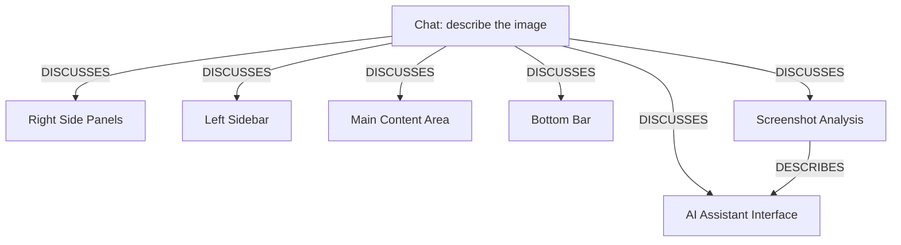

# Ontology: AI Interface Layout

**Summary**: Describes the structural components of a modern AI assistant user interface.

## 🗺️ Visual Concept Map

## 🌳 Sequential Topic Tree
> Shows how topics are hierarchically and sequentially related

- [[Chat: describe the image]]
  - *( discusses )*
  - [[AI Assistant Interface]]
  - *( discusses )*
  - [[Screenshot Analysis]]
  - *( discusses )*
  - [[Left Sidebar]]
  - *( discusses )*
  - [[Main Content Area]]
  - *( discusses )*
  - [[Right Side Panels]]
- [[Bottom Bar]]

## 📋 All Core Concepts
- [[Right Side Panels]]
- [[Left Sidebar]]
- [[Main Content Area]]
- [[AI Assistant Interface]]
- [[Bottom Bar]]
- [[Chat: describe the image]]
- [[Screenshot Analysis]]
