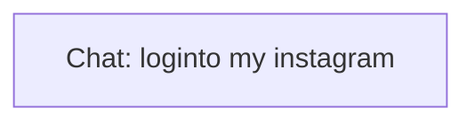

# Ontology: Account Access

**Summary**: The user is attempting to log into their Instagram account.

## 🗺️ Visual Concept Map

## 🌳 Sequential Topic Tree
> Shows how topics are hierarchically and sequentially related

- [[Chat: loginto my instagram]]

## 📋 All Core Concepts
- [[Chat: loginto my instagram]]
