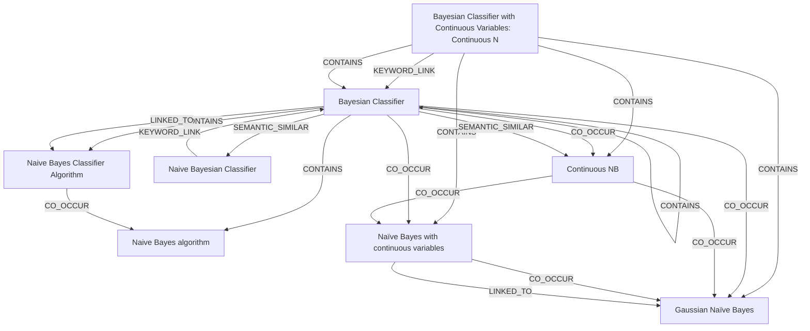

# Ontology: Bayesian Classification Methods

**Summary**: This group focuses on various implementations and variations of the Naive Bayes approach for classification tasks.

## 🗺️ Visual Concept Map

## 🌳 Sequential Topic Tree
> Shows how topics are hierarchically and sequentially related

- [[Bayesian Classifier]]
  - *( co_occur )*
  - [[Continuous NB]]
    - *( co_occur )*
    - [[Naïve Bayes with continuous variables]]
      - *( co_occur )*
      - [[Gaussian Naïve Bayes]]
- [[Bayesian Classifier with Continuous Variables:  Continuous N]]
- [[Naive Bayes Classifier Algorithm]]
  - *( co_occur )*
  - [[Naive Bayes algorithm]]
- [[Naive Bayesian Classifier]]

## 📋 All Core Concepts
- [[Bayesian Classifier with Continuous Variables:  Continuous N]]
- [[Naive Bayes Classifier Algorithm]]
- [[Naive Bayes algorithm]]
- [[Naive Bayesian Classifier]]
- [[Gaussian Naïve Bayes]]
- [[Naïve Bayes with continuous variables]]
- [[Bayesian Classifier]]
- [[Continuous NB]]
