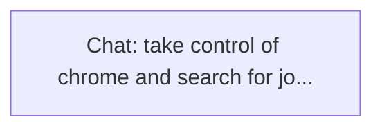

# Ontology: Browser Automation

**Summary**: This action involves controlling the Chrome browser to perform searches or tasks.

## 🗺️ Visual Concept Map

## 🌳 Sequential Topic Tree
> Shows how topics are hierarchically and sequentially related

- [[Chat: take control of chrome and search for jo...]]

## 📋 All Core Concepts
- [[Chat: take control of chrome and search for jo...]]
