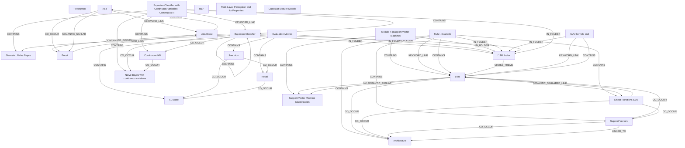

# Ontology: Classification Algorithms

**Summary**: This collection covers foundational and advanced machine learning models for classification tasks.

## 🗺️ Visual Concept Map

## 🌳 Sequential Topic Tree
> Shows how topics are hierarchically and sequentially related

- [[📁 ML Index]]
  - *( cross_theme )*
  - [[SVM]]
    - *( semantic_similar )*
    - [[Linear Functions SVM]]
      - *( co_occur )*
      - [[Support Vectors]]
        - *( co_occur )*
        - *( linked_to )*
      - *( co_occur )*
      - [[Architecture]]
    - *( co_occur )*
    - [[Support Vector Machine Classification]]
  - *( cross_theme )*
  - [[Perceptron]]
    - *( linked_to )*
    - [[Multi-Layer Perceptron]]
    - *( linked_to )*
    - [[ANNs]]
    - *( linked_to )*
    - [[Multilayer Perceptron]]
    - *( linked_to )*
    - [[Single-Layer Perceptron]]
- [[F1-score]]
- [[Ada]]
  - *( keyword_link )*
  - [[Ada Boost]]
    - *( contains )*
    - [[Boost]]
- [[Recall]]
  - *( linked_to )*
  - [[FPR]]
- [[Bayesian Classifier with Continuous Variables:  Continuous N]]
  - *( keyword_link )*
  - [[Bayesian Classifier]]
    - *( co_occur )*
    - [[Continuous NB]]
      - *( co_occur )*
      - [[Naïve Bayes with continuous variables]]
        - *( co_occur )*
        - *( linked_to )*
      - *( co_occur )*
      - [[Gaussian Naïve Bayes]]
- [[MLP]]
  - *( co_occur )*
  - [[LTU]]
- [[SVM kernels and]]
  - *( contains )*
  - [[Kernels]]
- [[Multi-Layer Perceptron and Its Properties]]
- [[Module 4 (Support Vector Machine)]]
- [[Evaluation Metrics]]
  - *( contains )*
  - [[Precision]]
    - *( linked_to )*
    - [[TPR]]
- [[Guassian Mixture Models]]
- [[SVM –Example]]

## 📋 All Core Concepts
- [[Perceptron]]
- [[F1-score]]
- [[Ada]]
- [[Recall]]
- [[Bayesian Classifier with Continuous Variables:  Continuous N]]
- [[MLP]]
- [[Support Vectors]]
- [[Support Vector Machine Classification]]
- [[Bayesian Classifier]]
- [[SVM kernels and]]
- [[Multi-Layer Perceptron and Its Properties]]
- [[Module 4 (Support Vector Machine)]]
- [[Naïve Bayes with continuous variables]]
- [[Gaussian Naïve Bayes]]
- [[Boost]]
- [[📁 ML Index]]
- [[Evaluation Metrics]]
- [[Architecture]]
- [[Linear Functions SVM]]
- [[Guassian Mixture Models]]
- [[SVM –Example]]
- [[Ada Boost]]
- [[Continuous NB]]
- [[Precision]]
- [[SVM]]
