# Ontology: Conversational AI Interaction

**Summary**: The entities primarily revolve around user-assistant dialogue, task execution, and general knowledge retrieval.

## 🗺️ Visual Concept Map

```mermaid
graph TD
    n0["sigma pandit"]
    n1["browser_get_credentials"]
    n2["Chat: 'C:\Users\ankit\OneDrive\Pictures\God of..."]
    n3["Chat: take controll of my chorome and research..."]
    n4["Chat: hi bud"]
    n5["Chat: take control of my chrome and search for..."]
    n6["Chat: what does this image describe"]
    n7["Chat: hi"]
    n8["Chat: 'C:\Users\ankit\OneDrive\Pictures\God of..."]
    n9["god of war"]
    n10["Chat: log into my instagram"]
    n11["Instagram"]
    n12["ScreenShot-2026-1-7_19-31-13.png"]
    n13["Chat: hi"]
    n14["Image Description Request"]
    n15["C:\Users\ankit\OneDrive\Pictures\God of War Ragnarok\ScreenShot-2026-1-7_19-31-13.png"]
    n16["log into Instagram"]
    n17["Instagram Story"]
    n18["Chat: log into my insta gram"]
    n19["Chat: Take control of my Chrome and search for..."]
    n20["Chat: log into my insta"]
    n21["User"]
    n22["God of War Ragnarok"]
    n23["post an image to Instagram"]
    n24["Assistant"]
    n21 -->|CONTACTED| n24
    n13 -->|DISCUSSES| n21
    n13 -->|DISCUSSES| n24
    n6 -->|DISCUSSES| n14
    n6 -->|DISCUSSES| n21
    n6 -->|DISCUSSES| n24
    n21 -->|INITIATED| n14
    n24 -->|FAILED_TO_COMPLETE| n14
    n21 -->|REQUESTED_ACTION| n11
    n24 -->|LIMITATION_ON| n11
    n20 -->|DISCUSSES| n11
    n20 -->|DISCUSSES| n21
    n20 -->|DISCUSSES| n24
    n20 -->|DISCUSSES| n16
    n24 -->|EXECUTING_TASK| n16
    n20 -->|DISCUSSES| n1
    n24 -->|USED_TOOL| n1
    n10 -->|DISCUSSES| n22
    n10 -->|DISCUSSES| n12
    n10 -->|DISCUSSES| n17
    n10 -->|DISCUSSES| n9
    n12 -->|LINKED_TO| n17
    n9 -->|ASSIGNED| n17
    n18 -->|DISCUSSES| n11
    n18 -->|DISCUSSES| n16
    n18 -->|DISCUSSES| n1
    n18 -->|DISCUSSES| n23
    n18 -->|DISCUSSES| n15
    n21 -->|INITIATED_TASK| n16
    n21 -->|INITIATED_TASK| n23
    n24 -->|PLANNING_FOR| n23
    n15 -->|INPUT_MEDIA_FOR| n23
    n18 -->|DISCUSSES| n0
    n21 -->|ASSIGNED_TASK_TO| n0
    n18 -->|DISCUSSES| n22
    n18 -->|DISCUSSES| n12
    n12 -->|ATTACHED_WITH_CAPTION| n9
    n18 -->|DISCUSSES| n9
    n12 -->|INTENDED_TO_SEND| n0
    n22 -->|SOURCE_OF| n12
    n8 -->|DISCUSSES| n22
    n8 -->|DISCUSSES| n0
    n8 -->|DISCUSSES| n15
    n8 -->|DISCUSSES| n9
    n15 -->|SENT_TO| n0
    n9 -->|CAPTION/CONTEXT| n15
    n2 -->|DISCUSSES| n15
    n2 -->|DISCUSSES| n0
    n2 -->|DISCUSSES| n9
    n3 -->|DISCUSSES| n21
```

## 🌳 Sequential Topic Tree
> Shows how topics are hierarchically and sequentially related

- [[Assistant]]
  - *( cross_theme )*
  - [[Chat: log into my insta gram]]
    - *( discusses )*
    - [[god of war]]
      - *( caption/context )*
      - [[C:\Users\ankit\OneDrive\Pictures\God of War Ragnarok\ScreenShot-2026-1-7_19-31-13.png]]
        - *( sent_to )*
        - *( input_media_for )*
      - *( assigned )*
      - [[Instagram Story]]
    - *( discusses )*
    - [[sigma pandit]]
    - *( discusses )*
    - [[ScreenShot-2026-1-7_19-31-13.png]]
    - *( discusses )*
    - [[Instagram]]
  - *( cross_theme )*
  - [[Chat: "C:\Users\ankit\OneDrive\Pictures\God of...]]
    - *( discusses )*
    - [[God of War Ragnarok]]
    - *( discusses )*
    - [[whatsapp_send_message]]
  - *( planning_for )*
  - [[post an image to Instagram]]
  - *( executing_task )*
  - [[log into Instagram]]
- [[browser_get_credentials]]
- [[Chat: "C:\Users\ankit\OneDrive\Pictures\God of...]]
- [[Chat: take controll of my chorome and research...]]
  - *( discusses )*
  - [[User]]
  - *( discusses )*
  - [[Job Search]]
  - *( discusses )*
  - [[New York]]
  - *( discusses )*
  - [[LinkedIn]]
  - *( discusses )*
  - [[Assistant/Model]]
- [[Chat: hi bud]]
  - *( discusses )*
  - [[Cyborg]]
  - *( discusses )*
  - [[local tasks]]
  - *( discusses )*
  - [[Iran's latest news]]
  - *( discusses )*
  - [[latest jobs]]
  - *( discusses )*
  - [[Search knowledge]]
- [[Chat: take control of my chrome and search for...]]
  - *( discusses )*
  - [[take control of my chrome and search for jobs]]
  - *( discusses )*
  - [[web_search_and_open]]
  - *( discusses )*
  - [[tax laws for freelancers]]
  - *( discusses )*
  - [[sde intern role job listings]]
  - *( discusses )*
  - [[open_chrome_and_navigate]]
- [[Chat: what does this image describe]]
  - *( discusses )*
  - [[Image Description Request]]
  - *( discusses )*
  - [[Missing Image Input]]
- [[Chat: hi]]
  - *( discusses )*
  - [[blackholes]]
  - *( discusses )*
  - [[web search]]
- [[Chat: log into my instagram]]
- [[Chat: hi]]
  - *( discusses )*
  - [[support vector machines (SVM)]]
  - *( discusses )*
  - [[principal component analysis (PCA)]]
  - *( discusses )*
  - [[Machine Learning concepts]]
- [[Chat: Take control of my Chrome and search for...]]
  - *( discusses )*
  - [[Data Scientist jobs in New York]]
  - *( discusses )*
  - [[Job Listings Search]]
- [[Chat: log into my insta]]

## 📋 All Core Concepts
- [[sigma pandit]]
- [[browser_get_credentials]]
- [[Chat: "C:\Users\ankit\OneDrive\Pictures\God of...]]
- [[Chat: take controll of my chorome and research...]]
- [[Chat: hi bud]]
- [[Chat: take control of my chrome and search for...]]
- [[Chat: what does this image describe]]
- [[Chat: hi]]
- [[Chat: "C:\Users\ankit\OneDrive\Pictures\God of...]]
- [[god of war]]
- [[Chat: log into my instagram]]
- [[Instagram]]
- [[ScreenShot-2026-1-7_19-31-13.png]]
- [[Chat: hi]]
- [[Image Description Request]]
- [[C:\Users\ankit\OneDrive\Pictures\God of War Ragnarok\ScreenShot-2026-1-7_19-31-13.png]]
- [[log into Instagram]]
- [[Instagram Story]]
- [[Chat: log into my insta gram]]
- [[Chat: Take control of my Chrome and search for...]]
- [[Chat: log into my insta]]
- [[User]]
- [[God of War Ragnarok]]
- [[post an image to Instagram]]
- [[Assistant]]
