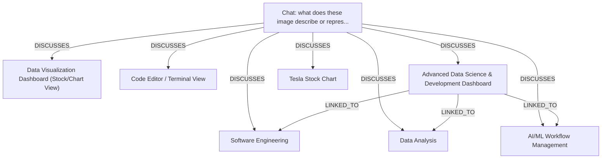

# Ontology: Data Science Workflow

**Summary**: This collection represents the tools and outputs for end-to-end data analysis, modeling, and visualization.

## 🗺️ Visual Concept Map

## 🌳 Sequential Topic Tree
> Shows how topics are hierarchically and sequentially related

- [[Chat: what does these image describe or repres...]]
  - *( discusses )*
  - [[Advanced Data Science & Development Dashboard]]
    - *( linked_to )*
    - [[Software Engineering]]
    - *( linked_to )*
    - [[Data Analysis]]
    - *( linked_to )*
    - [[AI/ML Workflow Management]]
  - *( discusses )*
  - [[Code Editor / Terminal View]]
- [[Data Visualization Dashboard (Stock/Chart View)]]
- [[Tesla Stock Chart]]

## 📋 All Core Concepts
- [[Data Visualization Dashboard (Stock/Chart View)]]
- [[Chat: what does these image describe or repres...]]
- [[Data Analysis]]
- [[Code Editor / Terminal View]]
- [[Advanced Data Science & Development Dashboard]]
- [[Tesla Stock Chart]]
- [[Software Engineering]]
- [[AI/ML Workflow Management]]
