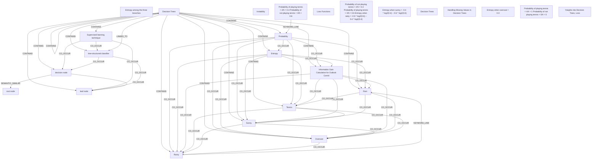

# Ontology: Decision Tree Metrics

**Summary**: This set of entities details the mathematical foundations and structural components used to build and evaluate decision trees.

## 🗺️ Visual Concept Map

## 🌳 Sequential Topic Tree
> Shows how topics are hierarchically and sequentially related

- [[Decision Trees]]
  - *( contains )*
  - [[Entropy]]
    - *( co_occur )*
    - [[Tennis]]
      - *( co_occur )*
      - [[Sunny]]
        - *( co_occur )*
        - *( co_occur )*
      - *( co_occur )*
      - [[Overcast]]
        - *( co_occur )*
      - *( co_occur )*
      - [[Rainy]]
        - *( keyword_link )*
    - *( co_occur )*
    - [[Rain]]
    - *( co_occur )*
    - [[Information Gain Calculation for Outlook Cont’d]]
  - *( contains )*
  - [[Probability]]
- [[Entropy among the three branches]]
- [[Supervised learning technique]]
  - *( co_occur )*
  - [[decision node]]
    - *( co_occur )*
    - [[leaf node]]
    - *( semantic_similar )*
    - [[root node]]
  - *( co_occur )*
  - [[tree-structured classifier]]
- [[Instability]]
  - *( semantic_similar )*
  - [[Decision Trees]]
- [[Probability of playing tennis = 2/5 = 0.4 Probability of not playing tennis = 3/5 = 0.6]]
- [[Loss Functions]]
  - *( co_occur )*
  - [[Handling Missing Values in Decision Trees]]
- [[Probability of not playing tennis = 2/5 = 0.4 Probability of playing tennis = 3/5 = 0.6 Entropy when rainy = -0.6 * log2(0.6) – 0.4 * log2(0.4)]]
- [[Entropy when sunny = -0.4 * log2(0.4) – 0.6 * log2(0.6)]]
- [[Entropy when overcast = 0.0]]
- [[Probability of playing tennis = 4/4 = 1 Probability of not playing tennis = 0/4 = 0]]
- [["Insights into Decision Trees, Loss]]

## 📋 All Core Concepts
- [[Entropy among the three branches]]
- [[Supervised learning technique]]
- [[Decision Trees]]
- [[Instability]]
- [[Sunny]]
- [[Rainy]]
- [[Probability of playing tennis = 2/5 = 0.4 Probability of not playing tennis = 3/5 = 0.6]]
- [[Loss Functions]]
- [[Probability of not playing tennis = 2/5 = 0.4 Probability of playing tennis = 3/5 = 0.6 Entropy when rainy = -0.6 * log2(0.6) – 0.4 * log2(0.4)]]
- [[Information Gain Calculation for Outlook Cont’d]]
- [[Probability]]
- [[Entropy when sunny = -0.4 * log2(0.4) – 0.6 * log2(0.6)]]
- [[Entropy]]
- [[Tennis]]
- [[Decision Trees]]
- [[root node]]
- [[Handling Missing Values in Decision Trees]]
- [[Entropy when overcast = 0.0]]
- [[decision node]]
- [[Probability of playing tennis = 4/4 = 1 Probability of not playing tennis = 0/4 = 0]]
- [["Insights into Decision Trees, Loss]]
- [[Overcast]]
- [[tree-structured classifier]]
- [[leaf node]]
- [[Rain]]
