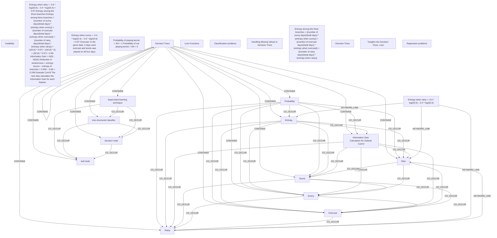

# Ontology: Decision Trees

**Summary**: A classification and regression technique used in machine learning.

## 🗺️ Visual Concept Map

## 🌳 Sequential Topic Tree
> Shows how topics are hierarchically and sequentially related

- [[Decision Trees]]
  - *( contains )*
  - [[Entropy]]
    - *( co_occur )*
    - [[Tennis]]
      - *( co_occur )*
      - [[Sunny]]
        - *( co_occur )*
        - *( co_occur )*
      - *( co_occur )*
      - [[Overcast]]
        - *( co_occur )*
      - *( co_occur )*
      - [[Rainy]]
        - *( keyword_link )*
    - *( co_occur )*
    - [[Rain]]
  - *( contains )*
  - [[Probability]]
- [[Entropy when rainy = -0.6 * log2(0.6) – 0.4 * log2(0.4)]]
- [[Information Gain Calculation for Outlook Cont’d]]
- [[Instability]]
  - *( semantic_similar )*
  - [[Decision Trees]]
- [[Entropy when rainy = -0.6 * log2(0.6) – 0.4 * log2(0.4) = 0.97 Entropy among the three branches Entropy among three branches = ((number of sunny days)/(total days) * (entropy when sunny)) + ((number of overcast days)/(total days) * (entropy when overcast)) + ((number of rainy days)/(total days) * (entropy when rainy)) = ((5/14) * 0.97) + ((4/14) * 0) + ((5/14) * 0.97) = 0.69 Information Gain = H(S) - H(S|X) Reduction in randomness = entropy source – entropy of branches = 0.940 – 0.69 = 0.246 Example Cont’d The next step calculates the Information Gain for each feature.]]
- [[Entropy when sunny = -0.4 * log2(0.4) – 0.6 * log2(0.6) = 0.97 Overcast: In the given data, 4 days were overcast and tennis was played on all four days.]]
  - *( keyword_link )*
  - [[Entropy when sunny = -0.4 * log2(0.4) – 0.6 * log2(0.6)]]
- [[Supervised learning technique]]
  - *( co_occur )*
  - [[tree-structured classifier]]
    - *( co_occur )*
    - [[decision node]]
      - *( co_occur )*
      - [[leaf node]]
  - *( co_occur )*
  - [[Classification problems]]
    - *( co_occur )*
    - [[Regression problems]]
- [[Probability of playing tennis = 4/4 = 1 Probability of not playing tennis = 0/4 = 0]]
  - *( keyword_link )*
  - [[Probability of playing tennis = 4/4 = 1]]
  - *( keyword_link )*
  - [[Probability of not playing tennis = 0/4 = 0]]
- [[Loss Functions]]
  - *( co_occur )*
  - [[Handling Missing Values in Decision Trees]]
- [[Entropy among the three branches = ((number of sunny days)/(total days) * (entropy when sunny)) + ((number of overcast days)/(total days) * (entropy when overcast)) + ((number of rainy days)/(total days) * (entropy when rainy))]]
- [["Insights into Decision Trees, Loss]]

## 📋 All Core Concepts
- [[Entropy when rainy = -0.6 * log2(0.6) – 0.4 * log2(0.4)]]
- [[Information Gain Calculation for Outlook Cont’d]]
- [[Rain]]
- [[Instability]]
- [[Entropy when rainy = -0.6 * log2(0.6) – 0.4 * log2(0.4) = 0.97 Entropy among the three branches Entropy among three branches = ((number of sunny days)/(total days) * (entropy when sunny)) + ((number of overcast days)/(total days) * (entropy when overcast)) + ((number of rainy days)/(total days) * (entropy when rainy)) = ((5/14) * 0.97) + ((4/14) * 0) + ((5/14) * 0.97) = 0.69 Information Gain = H(S) - H(S|X) Reduction in randomness = entropy source – entropy of branches = 0.940 – 0.69 = 0.246 Example Cont’d The next step calculates the Information Gain for each feature.]]
- [[Entropy when sunny = -0.4 * log2(0.4) – 0.6 * log2(0.6) = 0.97 Overcast: In the given data, 4 days were overcast and tennis was played on all four days.]]
- [[Supervised learning technique]]
- [[Rainy]]
- [[Overcast]]
- [[Probability of playing tennis = 4/4 = 1 Probability of not playing tennis = 0/4 = 0]]
- [[Decision Trees]]
- [[Tennis]]
- [[Loss Functions]]
- [[tree-structured classifier]]
- [[Probability]]
- [[decision node]]
- [[Classification problems]]
- [[leaf node]]
- [[Handling Missing Values in Decision Trees]]
- [[Entropy]]
- [[Sunny]]
- [[Entropy among the three branches = ((number of sunny days)/(total days) * (entropy when sunny)) + ((number of overcast days)/(total days) * (entropy when overcast)) + ((number of rainy days)/(total days) * (entropy when rainy))]]
- [[Decision Trees]]
- [["Insights into Decision Trees, Loss]]
- [[Regression problems]]
