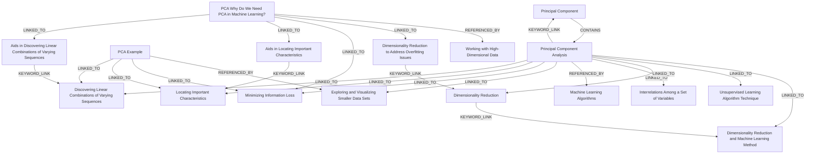

# Ontology: Dimensionality Reduction

**Summary**: A technique for reducing the number of random variables while retaining as much information as possible.

## 🗺️ Visual Concept Map

## 🌳 Sequential Topic Tree
> Shows how topics are hierarchically and sequentially related

- [[Principal Component Analysis]]
  - *( linked_to )*
  - [[Minimizing Information Loss]]
  - *( keyword_link )*
  - [[Principal Component]]
  - *( linked_to )*
  - [[Dimensionality Reduction and Machine Learning Method]]
  - *( linked_to )*
  - [[Dimensionality Reduction]]
  - *( linked_to )*
  - [[Exploring and Visualizing Smaller Data Sets]]
- [[Dimensionality Reduction to Address Overfitting Issues]]
- [[Unsupervised Learning Algorithm Technique]]
- [[PCA Example]]
  - *( linked_to )*
  - [[Locating Important Characteristics]]
  - *( linked_to )*
  - [[Discovering Linear Combinations of Varying Sequences]]
- [[Machine Learning Algorithms]]
- [[Working with High-Dimensional Data]]
- [[Interrelations Among a Set of Variables]]
- [[PCA Why Do We Need PCA in Machine Learning?]]
  - *( linked_to )*
  - [[Aids in Locating Important Characteristics]]
  - *( linked_to )*
  - [[Aids in Discovering Linear Combinations of Varying Sequences]]

## 📋 All Core Concepts
- [[Principal Component]]
- [[Dimensionality Reduction to Address Overfitting Issues]]
- [[Exploring and Visualizing Smaller Data Sets]]
- [[Unsupervised Learning Algorithm Technique]]
- [[PCA Example]]
- [[Discovering Linear Combinations of Varying Sequences]]
- [[Dimensionality Reduction and Machine Learning Method]]
- [[Machine Learning Algorithms]]
- [[Working with High-Dimensional Data]]
- [[Interrelations Among a Set of Variables]]
- [[Locating Important Characteristics]]
- [[Principal Component Analysis]]
- [[PCA Why Do We Need PCA in Machine Learning?]]
- [[Dimensionality Reduction]]
- [[Aids in Locating Important Characteristics]]
- [[Aids in Discovering Linear Combinations of Varying Sequences]]
- [[Minimizing Information Loss]]
