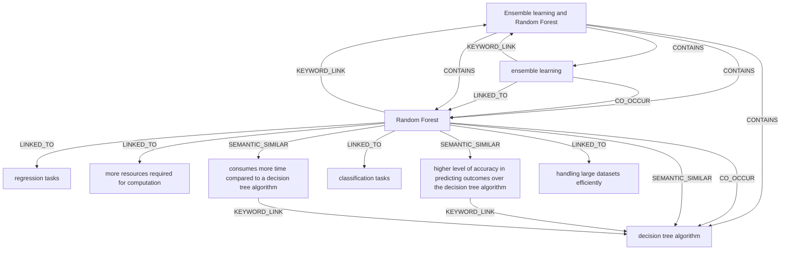

# Ontology: Ensemble Methods

**Summary**: These techniques combine multiple models to achieve superior predictive accuracy over individual components.

## 🗺️ Visual Concept Map

## 🌳 Sequential Topic Tree
> Shows how topics are hierarchically and sequentially related

- [[Random Forest]]
  - *( keyword_link )*
  - [[Ensemble learning and Random Forest]]
    - *( contains )*
    - [[decision tree algorithm]]
    - *( contains )*
    - [[ensemble learning]]
  - *( linked_to )*
  - [[regression tasks]]
  - *( linked_to )*
  - [[handling large datasets efficiently]]
- [[more resources required for computation]]
- [[higher level of accuracy in predicting outcomes over the decision tree algorithm]]
- [[classification tasks]]
- [[consumes more time compared to a decision tree algorithm]]

## 📋 All Core Concepts
- [[regression tasks]]
- [[more resources required for computation]]
- [[Ensemble learning and Random Forest]]
- [[higher level of accuracy in predicting outcomes over the decision tree algorithm]]
- [[classification tasks]]
- [[decision tree algorithm]]
- [[ensemble learning]]
- [[consumes more time compared to a decision tree algorithm]]
- [[Random Forest]]
- [[handling large datasets efficiently]]
