# Ontology: Fantasy Confrontation

**Summary**: The artwork depicts a warrior facing off against a bear amidst a cosmic, high-fantasy setting.

## 🗺️ Visual Concept Map

```mermaid
graph TD
    n0["Cosmic Backdrop"]
    n1["Man (Warrior/Barbarian)"]
    n2["Cosmic Background"]
    n3["Fantasy Setting"]
    n4["Man (Foreground)"]
    n5["Metallic Armor"]
    n6["Chat: hiiii"]
    n7["Bear (Midground/Background)"]
    n8["Humanoid Male Character"]
    n9["Warrior/Barbarian Character"]
    n10["Nebulae and Galaxies"]
    n11["Chat: describe this image"]
    n12["The Bear"]
    n13["Digital Artwork"]
    n14["Fantasy/Action Genres"]
    n15["Bear"]
    n16["Film/Movie Production Design"]
    n17["Chat: hi"]
    n18["High-Fantasy Digital Painting"]
    n19["Video Game Concept Art"]
    n20["visual_describe_screen"]
    n21["The Man"]
    n22["Chat: hi"]
    n23["Image Description"]
    n24["Grizzly Bear"]
    n11 -->|DISCUSSES| n23
    n11 -->|DISCUSSES| n9
    n11 -->|DISCUSSES| n24
    n11 -->|DISCUSSES| n0
    n11 -->|DISCUSSES| n18
    n9 -->|LINKED_TO| n23
    n24 -->|LINKED_TO| n23
    n0 -->|LINKED_TO| n23
    n6 -->|DISCUSSES| n20
    n6 -->|DISCUSSES| n13
    n6 -->|DISCUSSES| n1
    n6 -->|DISCUSSES| n15
    n6 -->|DISCUSSES| n2
    n6 -->|DISCUSSES| n10
    n6 -->|DISCUSSES| n5
    n1 -->|IS_ASSOCIATED_WITH| n15
    n1 -->|WEARS| n5
    n2 -->|COMPRISES| n10
    n17 -->|DISCUSSES| n21
    n17 -->|DISCUSSES| n12
    n17 -->|DISCUSSES| n13
    n17 -->|DISCUSSES| n19
    n17 -->|DISCUSSES| n16
    n13 -->|LINKED_TO| n19
    n22 -->|DISCUSSES| n13
    n22 -->|DISCUSSES| n4
    n22 -->|DISCUSSES| n7
    n22 -->|DISCUSSES| n0
    n22 -->|DISCUSSES| n3
    n4 -->|CONFRONTATION_PAIRED_WITH| n7
    n4 -->|IS_CHARACTERIZED_BY| n3
    n22 -->|DISCUSSES| n8
    n22 -->|DISCUSSES| n15
    n22 -->|DISCUSSES| n14
    n13 -->|LINKED_TO| n14
    n8 -->|LINKED_TO| n15
```

## 🌳 Sequential Topic Tree
> Shows how topics are hierarchically and sequentially related

- [[Chat: hiiii]]
  - *( discusses )*
  - [[Digital Artwork]]
    - *( linked_to )*
    - [[Video Game Concept Art]]
    - *( linked_to )*
    - [[Fantasy/Action Genres]]
  - *( discusses )*
  - [[Bear]]
  - *( discusses )*
  - [[Man (Warrior/Barbarian)]]
    - *( wears )*
    - [[Metallic Armor]]
  - *( discusses )*
  - [[visual_describe_screen]]
  - *( discusses )*
  - [[Cosmic Background]]
    - *( comprises )*
    - [[Nebulae and Galaxies]]
- [[Cosmic Backdrop]]
  - *( linked_to )*
  - [[Image Description]]
- [[Fantasy Setting]]
- [[Man (Foreground)]]
  - *( confrontation_paired_with )*
  - [[Bear (Midground/Background)]]
- [[Humanoid Male Character]]
- [[Warrior/Barbarian Character]]
- [[Chat: describe this image]]
  - *( discusses )*
  - [[Grizzly Bear]]
  - *( discusses )*
  - [[High-Fantasy Digital Painting]]
- [[The Bear]]
- [[Film/Movie Production Design]]
- [[Chat: hi]]
  - *( discusses )*
  - [[The Man]]
- [[Chat: hi]]

## 📋 All Core Concepts
- [[Cosmic Backdrop]]
- [[Man (Warrior/Barbarian)]]
- [[Cosmic Background]]
- [[Fantasy Setting]]
- [[Man (Foreground)]]
- [[Metallic Armor]]
- [[Chat: hiiii]]
- [[Bear (Midground/Background)]]
- [[Humanoid Male Character]]
- [[Warrior/Barbarian Character]]
- [[Nebulae and Galaxies]]
- [[Chat: describe this image]]
- [[The Bear]]
- [[Digital Artwork]]
- [[Fantasy/Action Genres]]
- [[Bear]]
- [[Film/Movie Production Design]]
- [[Chat: hi]]
- [[High-Fantasy Digital Painting]]
- [[Video Game Concept Art]]
- [[visual_describe_screen]]
- [[The Man]]
- [[Chat: hi]]
- [[Image Description]]
- [[Grizzly Bear]]
