# Ontology: Fantasy Confrontation

**Summary**: A high-fantasy depiction of a warrior facing off against a bear amidst cosmic grandeur.

## 🗺️ Visual Concept Map

```mermaid
graph TD
    n0["Film/Movie Production Design"]
    n1["Chat: hi"]
    n2["Chat: hiiii"]
    n3["High-Fantasy Digital Painting"]
    n4["The Man"]
    n5["Chat: describe this image"]
    n6["Cosmic Backdrop"]
    n7["visual_describe_screen"]
    n8["Grizzly Bear"]
    n9["Digital Artwork"]
    n10["Bear"]
    n11["The Bear"]
    n12["Man (Foreground)"]
    n13["Bear (Midground/Background)"]
    n14["Cosmic Background"]
    n15["Image Description"]
    n16["Fantasy/Action Genres"]
    n17["Humanoid Male Character"]
    n18["Man (Warrior/Barbarian)"]
    n19["Fantasy Setting"]
    n20["Nebulae and Galaxies"]
    n21["Metallic Armor"]
    n22["Chat: hi"]
    n23["Video Game Concept Art"]
    n24["Warrior/Barbarian Character"]
    n5 -->|DISCUSSES| n15
    n5 -->|DISCUSSES| n24
    n5 -->|DISCUSSES| n8
    n5 -->|DISCUSSES| n6
    n5 -->|DISCUSSES| n3
    n24 -->|LINKED_TO| n15
    n8 -->|LINKED_TO| n15
    n6 -->|LINKED_TO| n15
    n2 -->|DISCUSSES| n7
    n2 -->|DISCUSSES| n9
    n2 -->|DISCUSSES| n18
    n2 -->|DISCUSSES| n10
    n2 -->|DISCUSSES| n14
    n2 -->|DISCUSSES| n20
    n2 -->|DISCUSSES| n21
    n18 -->|IS_ASSOCIATED_WITH| n10
    n18 -->|WEARS| n21
    n14 -->|COMPRISES| n20
    n1 -->|DISCUSSES| n4
    n1 -->|DISCUSSES| n11
    n1 -->|DISCUSSES| n9
    n1 -->|DISCUSSES| n23
    n1 -->|DISCUSSES| n0
    n9 -->|LINKED_TO| n23
    n22 -->|DISCUSSES| n9
    n22 -->|DISCUSSES| n12
    n22 -->|DISCUSSES| n13
    n22 -->|DISCUSSES| n6
    n22 -->|DISCUSSES| n19
    n12 -->|CONFRONTATION_PAIRED_WITH| n13
    n12 -->|IS_CHARACTERIZED_BY| n19
    n22 -->|DISCUSSES| n17
    n22 -->|DISCUSSES| n10
    n22 -->|DISCUSSES| n16
    n9 -->|LINKED_TO| n16
    n17 -->|LINKED_TO| n10
```

## 🌳 Sequential Topic Tree
> Shows how topics are hierarchically and sequentially related

- [[Chat: hiiii]]
  - *( discusses )*
  - [[Digital Artwork]]
    - *( linked_to )*
    - [[Video Game Concept Art]]
    - *( linked_to )*
    - [[Fantasy/Action Genres]]
  - *( discusses )*
  - [[Bear]]
  - *( discusses )*
  - [[Man (Warrior/Barbarian)]]
    - *( wears )*
    - [[Metallic Armor]]
  - *( discusses )*
  - [[visual_describe_screen]]
  - *( discusses )*
  - [[Cosmic Background]]
    - *( comprises )*
    - [[Nebulae and Galaxies]]
- [[Film/Movie Production Design]]
- [[Chat: hi]]
  - *( discusses )*
  - [[The Man]]
  - *( discusses )*
  - [[The Bear]]
- [[High-Fantasy Digital Painting]]
- [[Chat: describe this image]]
  - *( discusses )*
  - [[Image Description]]
  - *( discusses )*
  - [[Cosmic Backdrop]]
  - *( discusses )*
  - [[Warrior/Barbarian Character]]
  - *( discusses )*
  - [[Grizzly Bear]]
- [[Man (Foreground)]]
  - *( confrontation_paired_with )*
  - [[Bear (Midground/Background)]]
  - *( is_characterized_by )*
  - [[Fantasy Setting]]
- [[Humanoid Male Character]]
- [[Chat: hi]]

## 📋 All Core Concepts
- [[Film/Movie Production Design]]
- [[Chat: hi]]
- [[Chat: hiiii]]
- [[High-Fantasy Digital Painting]]
- [[The Man]]
- [[Chat: describe this image]]
- [[Cosmic Backdrop]]
- [[visual_describe_screen]]
- [[Grizzly Bear]]
- [[Digital Artwork]]
- [[Bear]]
- [[The Bear]]
- [[Man (Foreground)]]
- [[Bear (Midground/Background)]]
- [[Cosmic Background]]
- [[Image Description]]
- [[Fantasy/Action Genres]]
- [[Humanoid Male Character]]
- [[Man (Warrior/Barbarian)]]
- [[Fantasy Setting]]
- [[Nebulae and Galaxies]]
- [[Metallic Armor]]
- [[Chat: hi]]
- [[Video Game Concept Art]]
- [[Warrior/Barbarian Character]]
