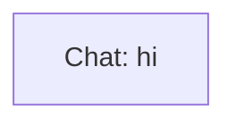

# Ontology: Greeting Exchange

**Summary**: The entity represents a simple, initial conversational opening.

## 🗺️ Visual Concept Map

## 🌳 Sequential Topic Tree
> Shows how topics are hierarchically and sequentially related

- [[Chat: hi]]

## 📋 All Core Concepts
- [[Chat: hi]]
