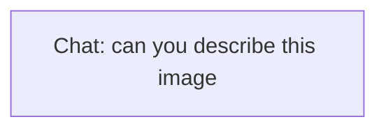

# Ontology: Image Captioning

**Summary**: Describes visual content within an image for textual understanding.

## 🗺️ Visual Concept Map

## 🌳 Sequential Topic Tree
> Shows how topics are hierarchically and sequentially related

- [[Chat: can you describe this image]]

## 📋 All Core Concepts
- [[Chat: can you describe this image]]
