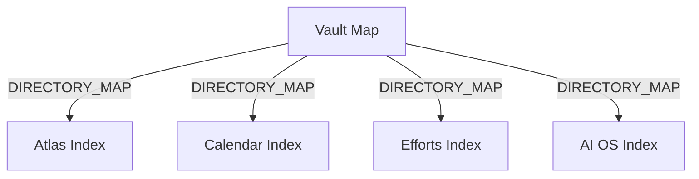

# Ontology: Indexing System

**Summary**: A system for categorizing and organizing knowledge.

## 🗺️ Visual Concept Map

## 🌳 Sequential Topic Tree
> Shows how topics are hierarchically and sequentially related

- [[Vault Map]]
  - *( directory_map )*
  - [[Atlas Index]]
  - *( directory_map )*
  - [[Calendar Index]]
  - *( directory_map )*
  - [[Efforts Index]]
  - *( directory_map )*
  - [[AI OS Index]]

## 📋 All Core Concepts
- [[Calendar Index]]
- [[AI OS Index]]
- [[Efforts Index]]
- [[Vault Map]]
- [[Atlas Index]]
