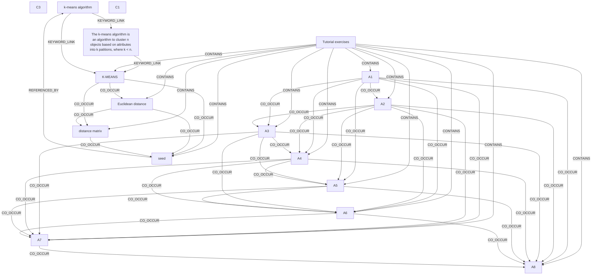

# Ontology: K-Means Clustering

**Summary**: This set of entities details the mechanics and components required to execute the k-means clustering algorithm.

## 🗺️ Visual Concept Map

## 🌳 Sequential Topic Tree
> Shows how topics are hierarchically and sequentially related

- [[Tutorial exercises]]
  - *( contains )*
  - [[K-MEANS]]
    - *( co_occur )*
    - [[Euclidean distance]]
      - *( co_occur )*
      - [[seed]]
        - *( referenced_by )*
      - *( co_occur )*
      - [[distance matrix]]
  - *( contains )*
  - [[A1]]
    - *( co_occur )*
    - [[A2]]
      - *( co_occur )*
      - [[A3]]
        - *( co_occur )*
        - *( co_occur )*
        - *( co_occur )*
        - *( co_occur )*
        - *( co_occur )*
      - *( co_occur )*
      - [[A4]]
        - *( co_occur )*
        - *( co_occur )*
        - *( co_occur )*
        - *( co_occur )*
      - *( co_occur )*
      - [[A5]]
        - *( co_occur )*
        - *( co_occur )*
        - *( co_occur )*
      - *( co_occur )*
      - [[A6]]
        - *( co_occur )*
        - *( co_occur )*
      - *( co_occur )*
      - [[A7]]
        - *( co_occur )*
- [[A8]]
- [[C3]]
- [[k-means algorithm]]
  - *( keyword_link )*
  - [[The k-means algorithm is an algorithm to cluster n objects based on attributes into k patitions, where k < n.]]
- [[C1]]

## 📋 All Core Concepts
- [[A4]]
- [[A5]]
- [[A8]]
- [[A1]]
- [[A6]]
- [[C3]]
- [[k-means algorithm]]
- [[A7]]
- [[Euclidean distance]]
- [[seed]]
- [[A3]]
- [[distance matrix]]
- [[C1]]
- [[K-MEANS]]
- [[Tutorial exercises]]
- [[A2]]
- [[The k-means algorithm is an algorithm to cluster n objects based on attributes into k patitions, where k < n.]]
