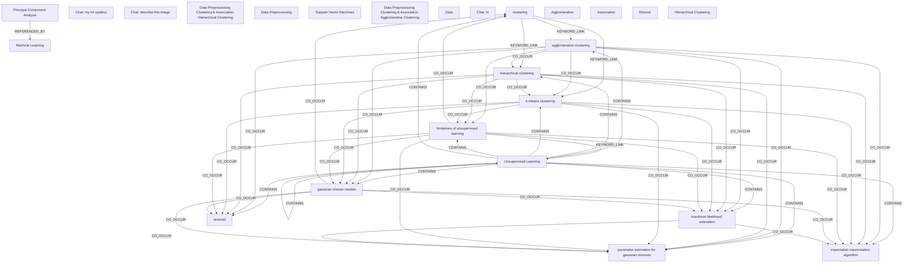

# Ontology: ML Techniques Overview

**Summary**: This collection covers foundational machine learning concepts, including various learning paradigms and dimensionality reduction methods.

## 🗺️ Visual Concept Map

## 🌳 Sequential Topic Tree
> Shows how topics are hierarchically and sequentially related

- [[clustering]]
  - *( keyword_link )*
  - [[hierarchical clustering]]
    - *( linked_to )*
    - [[Machine Learning]]
      - *( cross_theme )*
      - [[Unsupervised Learning]]
        - *( contains )*
        - *( semantic_similar )*
      - *( cross_theme )*
      - [[Chat: my ml sylabus]]
        - *( discusses )*
        - *( discusses )*
        - *( discusses )*
        - *( discusses )*
      - *( keyword_link )*
      - [[Introduction to Machine Learning]]
        - *( contains )*
      - *( co_occur )*
      - [[apples]]
    - *( co_occur )*
    - [[gaussian mixture models]]
      - *( co_occur )*
      - [[maximum likelihood estimation]]
        - *( co_occur )*
        - *( co_occur )*
        - *( co_occur )*
      - *( co_occur )*
      - [[parameter estimation for gaussian mixtures]]
        - *( co_occur )*
        - *( co_occur )*
      - *( co_occur )*
      - [[expectation maximization algorithm]]
        - *( co_occur )*
      - *( co_occur )*
      - [[centroid]]
    - *( co_occur )*
    - [[k-means clustering]]
      - *( co_occur )*
      - [[limitations of unsupervised learning]]
  - *( keyword_link )*
  - [[agglomerative clustering]]
  - *( co_occur )*
  - [[Association]]
- [[Chat: describe this image]]
  - *( discusses )*
  - [[Principal Component Analysis]]
    - *( keyword_link )*
    - [[Principal Component]]
    - *( linked_to )*
    - [[Dimensionality Reduction]]
    - *( linked_to )*
    - [[Dimensionality Reduction and Machine Learning Method]]
    - *( linked_to )*
    - [[Unsupervised Learning Algorithm Technique]]
- [[Data Preprocessing Clustering & Association Hierarchical Clustering]]
  - *( keyword_link )*
  - [[Data]]
    - *( contains )*
    - [[Data Preprocessing]]
    - *( keyword_link )*
    - [[Exploring and Visualizing Data]]
  - *( keyword_link )*
  - [[Hierarchical Clustering]]
    - *( linked_to )*
    - [[Agglomerative]]
    - *( linked_to )*
    - [[Divisive]]
- [[Support Vector Machines]]
- [[Data Preprocessing Clustering & Association Agglomerative Clustering]]
- [[Chat: hi]]

## 📋 All Core Concepts
- [[clustering]]
- [[k-means clustering]]
- [[Chat: my ml sylabus]]
- [[maximum likelihood estimation]]
- [[parameter estimation for gaussian mixtures]]
- [[Chat: describe this image]]
- [[Unsupervised Learning]]
- [[Data Preprocessing Clustering & Association Hierarchical Clustering]]
- [[gaussian mixture models]]
- [[Data Preprocessing]]
- [[Support Vector Machines]]
- [[Data Preprocessing Clustering & Association Agglomerative Clustering]]
- [[expectation maximization algorithm]]
- [[Data]]
- [[Chat: hi]]
- [[centroid]]
- [[Principal Component Analysis]]
- [[limitations of unsupervised learning]]
- [[Agglomerative]]
- [[Machine Learning]]
- [[agglomerative clustering]]
- [[Association]]
- [[hierarchical clustering]]
- [[Divisive]]
- [[Hierarchical Clustering]]
