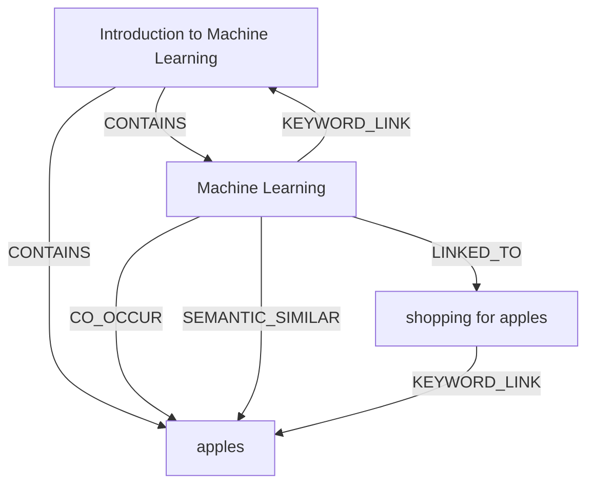

# Ontology: Machine Learning

**Summary**: The study and implementation of algorithms that allow computers to learn from and make decisions based on data.

## 🗺️ Visual Concept Map

## 🌳 Sequential Topic Tree
> Shows how topics are hierarchically and sequentially related

- [[Machine Learning]]
  - *( keyword_link )*
  - [[Introduction to Machine Learning]]
    - *( contains )*
    - [[apples]]
  - *( linked_to )*
  - [[shopping for apples]]

## 📋 All Core Concepts
- [[shopping for apples]]
- [[Introduction to Machine Learning]]
- [[Machine Learning]]
- [[apples]]
