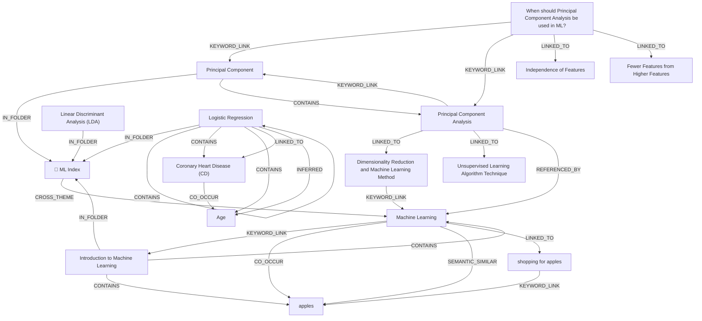

# Ontology: Machine Learning

**Summary**: A field of study that uses statistical techniques to give computers the ability to learn without being explicitly programmed.

## 🗺️ Visual Concept Map

## 🌳 Sequential Topic Tree
> Shows how topics are hierarchically and sequentially related

- [[📁 ML Index]]
  - *( cross_theme )*
  - [[Machine Learning]]
    - *( keyword_link )*
    - [[Introduction to Machine Learning]]
      - *( contains )*
      - [[apples]]
    - *( linked_to )*
    - [[shopping for apples]]
- [[Principal Component]]
  - *( contains )*
  - [[Principal Component Analysis]]
    - *( linked_to )*
    - [[Dimensionality Reduction and Machine Learning Method]]
    - *( linked_to )*
    - [[Unsupervised Learning Algorithm Technique]]
- [[When should Principal Component Analysis be used in ML?]]
  - *( linked_to )*
  - [[Independence of Features]]
  - *( linked_to )*
  - [[Fewer Features from Higher Features]]
- [[Coronary Heart Disease (CD)]]
  - *( co_occur )*
  - [[Age]]
- [[Linear Discriminant Analysis (LDA)]]
- [[Logistic Regression]]

## 📋 All Core Concepts
- [[Principal Component]]
- [[shopping for apples]]
- [[Unsupervised Learning Algorithm Technique]]
- [[📁 ML Index]]
- [[Dimensionality Reduction and Machine Learning Method]]
- [[Machine Learning]]
- [[When should Principal Component Analysis be used in ML?]]
- [[Introduction to Machine Learning]]
- [[Independence of Features]]
- [[Fewer Features from Higher Features]]
- [[Coronary Heart Disease (CD)]]
- [[Principal Component Analysis]]
- [[Linear Discriminant Analysis (LDA)]]
- [[Logistic Regression]]
- [[Age]]
- [[apples]]
