# Ontology: Machine Learning

**Summary**: A comprehensive guide to the field of machine learning, including foundational concepts and advanced techniques.

## 🗺️ Visual Concept Map

```mermaid
graph TD
    n0["Goal"]
    n1["convex"]
    n2["Chat: machine learning sylabus"]
    n3["Loss Function"]
    n4["Machine Learning"]
    n5["apples"]
    n6["Minimize"]
    n7["Gradient-Based Optimization"]
    n8["Support Vector Machines"]
    n9["Batch Gradient Descent"]
    n10["Objective Function"]
    n11["Optimal Parameters"]
    n12["Maximize"]
    n13["Error Function"]
    n14["Cost function = 0 + 1 x (1.4)2"]
    n15["Supervised Learning"]
    n16["function"]
    n17["Linear Regression"]
    n18["Neural Networks"]
    n19["Gradient Descent Algorithm"]
    n20["Convex Optimization"]
    n21["Cost Function"]
    n22["Linear Programming Problem"]
    n23["Introduction to Machine Learning"]
    n24["Convex Function"]
    n4 -->|KEYWORD_LINK| n23
    n23 -->|CONTAINS| n4
    n23 -->|CONTAINS| n5
    n4 -->|CO_OCCUR| n5
    n4 -->|SEMANTIC_SIMILAR| n5
    n5 -->|LINKED_TO| n4
    n1 -->|KEYWORD_LINK| n20
    n20 -->|CONTAINS| n1
    n20 -->|CONTAINS| n16
    n1 -->|CO_OCCUR| n16
    n1 -->|SEMANTIC_SIMILAR| n16
    n7 -->|CONTAINS| n7
    n7 -->|CONTAINS| n6
    n7 -->|CONTAINS| n12
    n10 -->|KEYWORD_LINK| n16
    n7 -->|CONTAINS| n10
    n21 -->|KEYWORD_LINK| n16
    n7 -->|CONTAINS| n21
    n3 -->|KEYWORD_LINK| n16
    n7 -->|CONTAINS| n3
    n13 -->|KEYWORD_LINK| n16
    n7 -->|CONTAINS| n13
    n7 -->|CONTAINS| n20
    n7 -->|CONTAINS| n4
    n7 -->|CONTAINS| n22
    n24 -->|KEYWORD_LINK| n1
    n24 -->|KEYWORD_LINK| n16
    n7 -->|CONTAINS| n24
    n7 -->|CONTAINS| n11
    n7 -->|CONTAINS| n17
    n7 -->|CONTAINS| n8
    n7 -->|CONTAINS| n18
    n7 -->|CONTAINS| n19
    n7 -->|CONTAINS| n9
    n6 -->|CO_OCCUR| n12
    n6 -->|CO_OCCUR| n10
    n6 -->|CO_OCCUR| n21
    n6 -->|CO_OCCUR| n3
    n6 -->|CO_OCCUR| n13
    n6 -->|CO_OCCUR| n20
    n6 -->|CO_OCCUR| n4
    n6 -->|CO_OCCUR| n22
    n6 -->|CO_OCCUR| n24
    n6 -->|CO_OCCUR| n11
    n6 -->|CO_OCCUR| n17
    n6 -->|CO_OCCUR| n8
    n6 -->|CO_OCCUR| n18
    n6 -->|CO_OCCUR| n19
    n6 -->|CO_OCCUR| n9
    n12 -->|CO_OCCUR| n10
```

## 🌳 Sequential Topic Tree
> Shows how topics are hierarchically and sequentially related

- [[Cost Function]]
  - *( co_occur )*
  - [[Machine Learning]]
    - *( co_occur )*
    - [[Linear Regression]]
      - *( referenced_by )*
      - [[Convex Optimization]]
        - *( co_occur )*
        - *( co_occur )*
        - *( co_occur )*
      - *( co_occur )*
      - [[Neural Networks]]
        - *( co_occur )*
        - *( co_occur )*
        - *( discussed/decided/assigned/linked_to )*
      - *( co_occur )*
      - [[Support Vector Machines]]
        - *( co_occur )*
        - *( co_occur )*
      - *( co_occur )*
      - [[Gradient Descent Algorithm]]
        - *( co_occur )*
      - *( co_occur )*
      - [[Batch Gradient Descent]]
    - *( co_occur )*
    - [[Convex Function]]
      - *( co_occur )*
      - [[Optimal Parameters]]
    - *( co_occur )*
    - [[Linear Programming Problem]]
  - *( co_occur )*
  - [[Loss Function]]
- [[Goal]]
- [[convex]]
  - *( co_occur )*
  - [[function]]
- [[Chat: machine learning sylabus]]
  - *( discusses )*
  - [[Supervised Learning]]
  - *( discusses )*
  - [[Unsupervised Learning]]
  - *( discusses )*
  - [[Reinforcement Learning]]
- [[apples]]
- [[Minimize]]
- [[Gradient-Based Optimization]]
- [[Objective Function]]
- [[Maximize]]
- [[Error Function]]
- [[Cost function = 0 + 1 x (1.4)2]]
- [[Introduction to Machine Learning]]

## 📋 All Core Concepts
- [[Goal]]
- [[convex]]
- [[Chat: machine learning sylabus]]
- [[Loss Function]]
- [[Machine Learning]]
- [[apples]]
- [[Minimize]]
- [[Gradient-Based Optimization]]
- [[Support Vector Machines]]
- [[Batch Gradient Descent]]
- [[Objective Function]]
- [[Optimal Parameters]]
- [[Maximize]]
- [[Error Function]]
- [[Cost function = 0 + 1 x (1.4)2]]
- [[Supervised Learning]]
- [[function]]
- [[Linear Regression]]
- [[Neural Networks]]
- [[Gradient Descent Algorithm]]
- [[Convex Optimization]]
- [[Cost Function]]
- [[Linear Programming Problem]]
- [[Introduction to Machine Learning]]
- [[Convex Function]]
