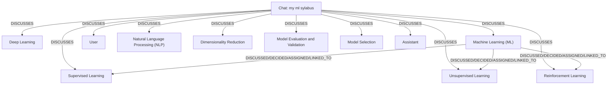

# Ontology: Machine Learning

**Summary**: A comprehensive guide to the field of machine learning, including its subfields and applications.

## 🗺️ Visual Concept Map

## 🌳 Sequential Topic Tree
> Shows how topics are hierarchically and sequentially related

- [[Chat: my ml sylabus]]
  - *( discusses )*
  - [[Machine Learning (ML)]]
    - *( discussed/decided/assigned/linked_to )*
    - [[Supervised Learning]]
    - *( discussed/decided/assigned/linked_to )*
    - [[Unsupervised Learning]]
    - *( discussed/decided/assigned/linked_to )*
    - [[Reinforcement Learning]]
  - *( discusses )*
  - [[Dimensionality Reduction]]
- [[Deep Learning]]
- [[User]]
- [[Natural Language Processing (NLP)]]
- [[Model Evaluation and Validation]]
- [[Model Selection]]
- [[Assistant]]

## 📋 All Core Concepts
- [[Deep Learning]]
- [[Reinforcement Learning]]
- [[Machine Learning (ML)]]
- [[User]]
- [[Natural Language Processing (NLP)]]
- [[Dimensionality Reduction]]
- [[Model Evaluation and Validation]]
- [[Unsupervised Learning]]
- [[Chat: my ml sylabus]]
- [[Model Selection]]
- [[Supervised Learning]]
- [[Assistant]]
