# Ontology: Machine Learning

**Summary**: A comprehensive guide to the field of machine learning, including foundational concepts and advanced techniques.

## 🗺️ Visual Concept Map

```mermaid
graph TD
    n0["Cost function = 0 + 1 x (1.4)2"]
    n1["Chat: machine learning sylabus"]
    n2["Minimize"]
    n3["Goal"]
    n4["convex"]
    n5["apples"]
    n6["Cost Function"]
    n7["Gradient Descent Algorithm"]
    n8["Batch Gradient Descent"]
    n9["Convex Function"]
    n10["Error Function"]
    n11["Objective Function"]
    n12["function"]
    n13["Neural Networks"]
    n14["Machine Learning"]
    n15["Introduction to Machine Learning"]
    n16["Linear Programming Problem"]
    n17["Loss Function"]
    n18["Optimal Parameters"]
    n19["Supervised Learning"]
    n20["Linear Regression"]
    n21["Support Vector Machines"]
    n22["Convex Optimization"]
    n23["Maximize"]
    n24["Gradient-Based Optimization"]
    n14 -->|KEYWORD_LINK| n15
    n15 -->|CONTAINS| n14
    n15 -->|CONTAINS| n5
    n14 -->|CO_OCCUR| n5
    n14 -->|SEMANTIC_SIMILAR| n5
    n5 -->|LINKED_TO| n14
    n4 -->|KEYWORD_LINK| n22
    n22 -->|CONTAINS| n4
    n22 -->|CONTAINS| n12
    n4 -->|CO_OCCUR| n12
    n4 -->|SEMANTIC_SIMILAR| n12
    n24 -->|CONTAINS| n24
    n24 -->|CONTAINS| n2
    n24 -->|CONTAINS| n23
    n11 -->|KEYWORD_LINK| n12
    n24 -->|CONTAINS| n11
    n6 -->|KEYWORD_LINK| n12
    n24 -->|CONTAINS| n6
    n17 -->|KEYWORD_LINK| n12
    n24 -->|CONTAINS| n17
    n10 -->|KEYWORD_LINK| n12
    n24 -->|CONTAINS| n10
    n24 -->|CONTAINS| n22
    n24 -->|CONTAINS| n14
    n24 -->|CONTAINS| n16
    n9 -->|KEYWORD_LINK| n4
    n9 -->|KEYWORD_LINK| n12
    n24 -->|CONTAINS| n9
    n24 -->|CONTAINS| n18
    n24 -->|CONTAINS| n20
    n24 -->|CONTAINS| n21
    n24 -->|CONTAINS| n13
    n24 -->|CONTAINS| n7
    n24 -->|CONTAINS| n8
    n2 -->|CO_OCCUR| n23
    n2 -->|CO_OCCUR| n11
    n2 -->|CO_OCCUR| n6
    n2 -->|CO_OCCUR| n17
    n2 -->|CO_OCCUR| n10
    n2 -->|CO_OCCUR| n22
    n2 -->|CO_OCCUR| n14
    n2 -->|CO_OCCUR| n16
    n2 -->|CO_OCCUR| n9
    n2 -->|CO_OCCUR| n18
    n2 -->|CO_OCCUR| n20
    n2 -->|CO_OCCUR| n21
    n2 -->|CO_OCCUR| n13
    n2 -->|CO_OCCUR| n7
    n2 -->|CO_OCCUR| n8
    n23 -->|CO_OCCUR| n11
```

## 🌳 Sequential Topic Tree
> Shows how topics are hierarchically and sequentially related

- [[Cost Function]]
  - *( co_occur )*
  - [[Machine Learning]]
    - *( co_occur )*
    - [[Linear Regression]]
      - *( referenced_by )*
      - [[Convex Optimization]]
        - *( co_occur )*
        - *( co_occur )*
        - *( co_occur )*
      - *( co_occur )*
      - [[Neural Networks]]
        - *( co_occur )*
        - *( co_occur )*
        - *( discussed/decided/assigned/linked_to )*
      - *( co_occur )*
      - [[Support Vector Machines]]
        - *( co_occur )*
        - *( co_occur )*
      - *( co_occur )*
      - [[Gradient Descent Algorithm]]
        - *( co_occur )*
      - *( co_occur )*
      - [[Batch Gradient Descent]]
    - *( co_occur )*
    - [[Convex Function]]
      - *( co_occur )*
      - [[Optimal Parameters]]
    - *( co_occur )*
    - [[Linear Programming Problem]]
  - *( co_occur )*
  - [[Loss Function]]
- [[Cost function = 0 + 1 x (1.4)2]]
  - *( keyword_link )*
  - [[function]]
- [[Chat: machine learning sylabus]]
  - *( discusses )*
  - [[Supervised Learning]]
  - *( discusses )*
  - [[Unsupervised Learning]]
  - *( discusses )*
  - [[Reinforcement Learning]]
- [[Minimize]]
- [[Goal]]
- [[convex]]
- [[apples]]
- [[Error Function]]
- [[Objective Function]]
- [[Introduction to Machine Learning]]
- [[Maximize]]
- [[Gradient-Based Optimization]]

## 📋 All Core Concepts
- [[Cost function = 0 + 1 x (1.4)2]]
- [[Chat: machine learning sylabus]]
- [[Minimize]]
- [[Goal]]
- [[convex]]
- [[apples]]
- [[Cost Function]]
- [[Gradient Descent Algorithm]]
- [[Batch Gradient Descent]]
- [[Convex Function]]
- [[Error Function]]
- [[Objective Function]]
- [[function]]
- [[Neural Networks]]
- [[Machine Learning]]
- [[Introduction to Machine Learning]]
- [[Linear Programming Problem]]
- [[Loss Function]]
- [[Optimal Parameters]]
- [[Supervised Learning]]
- [[Linear Regression]]
- [[Support Vector Machines]]
- [[Convex Optimization]]
- [[Maximize]]
- [[Gradient-Based Optimization]]
