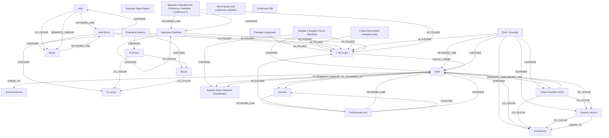

# Ontology: Metrics

**Summary**: Evaluation criteria for classification models

## 🗺️ Visual Concept Map

## 🌳 Sequential Topic Tree
> Shows how topics are hierarchically and sequentially related

- [[📁 ML Index]]
  - *( cross_theme )*
  - [[SVM]]
    - *( semantic_similar )*
    - [[Linear Functions SVM]]
      - *( co_occur )*
      - [[Support Vectors]]
        - *( co_occur )*
        - *( linked_to )*
      - *( co_occur )*
      - [[Architecture]]
    - *( co_occur )*
    - [[Support Vector Machine Classification]]
- [[Evaluation Metrics]]
  - *( contains )*
  - [[Precision]]
    - *( co_occur )*
    - [[Recall]]
      - *( co_occur )*
      - [[F1-score]]
      - *( linked_to )*
      - [[FPR]]
    - *( linked_to )*
    - [[TPR]]
- [[Bayesian Classifier with Continuous Variables:  Continuous N]]
  - *( keyword_link )*
  - [[Bayesian Classifier]]
    - *( co_occur )*
    - [[Continuous NB]]
      - *( co_occur )*
      - [[Naïve Bayes with continuous variables]]
        - *( co_occur )*
        - *( linked_to )*
      - *( co_occur )*
      - [[Gaussian Naïve Bayes]]
- [[SVM kernels and]]
  - *( contains )*
  - [[Kernels]]
- [[Kernel functions]]
- [[SVM –Example]]
- [[Ada]]
  - *( keyword_link )*
  - [[Ada Boost]]
    - *( contains )*
    - [[Boost]]
- [[Linear Discriminant Analysis (LDA)]]
- [[Principal Component]]
- [[Module 4 (Support Vector Machine)]]

## 📋 All Core Concepts
- [[Evaluation Metrics]]
- [[Architecture]]
- [[Bayesian Classifier with Continuous Variables:  Continuous N]]
- [[SVM kernels and]]
- [[Gaussian Naïve Bayes]]
- [[Kernel functions]]
- [[SVM –Example]]
- [[Recall]]
- [[Support Vectors]]
- [[F1-score]]
- [[Bayesian Classifier]]
- [[Ada]]
- [[📁 ML Index]]
- [[SVM]]
- [[Linear Discriminant Analysis (LDA)]]
- [[Support Vector Machine Classification]]
- [[Linear Functions SVM]]
- [[Principal Component]]
- [[Boost]]
- [[Kernels]]
- [[Module 4 (Support Vector Machine)]]
- [[Naïve Bayes with continuous variables]]
- [[Ada Boost]]
- [[Precision]]
- [[Continuous NB]]
