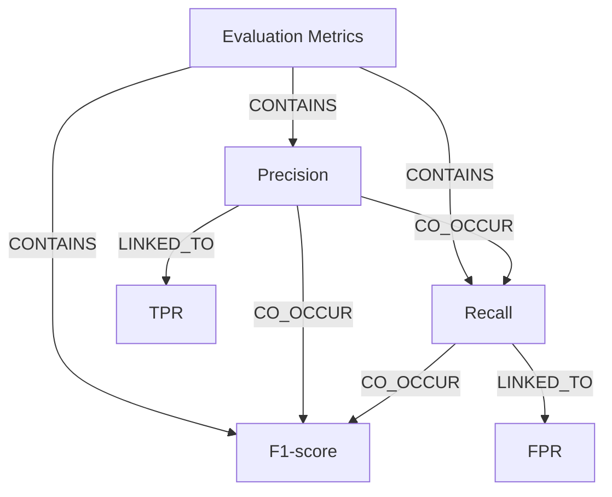

# Ontology: Metrics

**Summary**: Evaluation criteria for model performance

## 🗺️ Visual Concept Map

## 🌳 Sequential Topic Tree
> Shows how topics are hierarchically and sequentially related

- [[Evaluation Metrics]]
  - *( contains )*
  - [[Precision]]
    - *( co_occur )*
    - [[Recall]]
      - *( co_occur )*
      - [[F1-score]]
      - *( linked_to )*
      - [[FPR]]
    - *( linked_to )*
    - [[TPR]]

## 📋 All Core Concepts
- [[FPR]]
- [[Recall]]
- [[F1-score]]
- [[Evaluation Metrics]]
- [[Precision]]
- [[TPR]]
