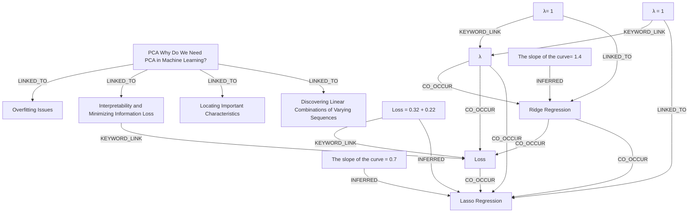

# Ontology: Model Evaluation and Feature Selection

**Summary**: Analyzing knowledge graph entities related to model evaluation, feature selection, and machine learning techniques.

## 🗺️ Visual Concept Map

## 🌳 Sequential Topic Tree
> Shows how topics are hierarchically and sequentially related

- [[Loss]]
  - *( co_occur )*
  - [[Lasso Regression]]
- [[The slope of the curve = 0.7]]
- [[λ= 1]]
  - *( linked_to )*
  - [[Ridge Regression]]
  - *( keyword_link )*
  - [[λ]]
- [[Interpretability and Minimizing Information Loss]]
- [[Locating Important Characteristics]]
- [[Overfitting Issues]]
- [[λ = 1]]
- [[PCA Why Do We Need PCA in Machine Learning?]]
  - *( linked_to )*
  - [[Discovering Linear Combinations of Varying Sequences]]
- [[Loss = 0.32 + 0.22]]
- [[The slope of the curve= 1.4]]

## 📋 All Core Concepts
- [[The slope of the curve = 0.7]]
- [[λ= 1]]
- [[Lasso Regression]]
- [[Interpretability and Minimizing Information Loss]]
- [[Locating Important Characteristics]]
- [[Ridge Regression]]
- [[Overfitting Issues]]
- [[λ = 1]]
- [[PCA Why Do We Need PCA in Machine Learning?]]
- [[Loss = 0.32 + 0.22]]
- [[Loss]]
- [[λ]]
- [[The slope of the curve= 1.4]]
- [[Discovering Linear Combinations of Varying Sequences]]
