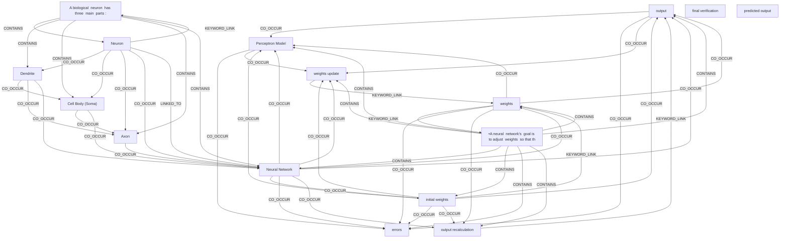

# Ontology: Neural Computation

**Summary**: This knowledge set details the structure of biological neurons and the mathematical process used in artificial neural networks to learn from data.

## 🗺️ Visual Concept Map

## 🌳 Sequential Topic Tree
> Shows how topics are hierarchically and sequentially related

- [[Neural Network]]
  - *( co_occur )*
  - [[output]]
    - *( co_occur )*
    - [[Perceptron Model]]
      - *( co_occur )*
      - [[output recalculation]]
        - *( semantic_similar )*
      - *( co_occur )*
      - [[errors]]
        - *( co_occur )*
      - *( co_occur )*
      - [[weights update]]
        - *( keyword_link )*
    - *( semantic_similar )*
    - [[predicted output]]
  - *( co_occur )*
  - [[weights]]
    - *( keyword_link )*
    - [[•A neural  network's  goal is to adjust  weights  so that th]]
- [[initial weights]]
- [[A biological  neuron  has three  main  parts :]]
  - *( contains )*
  - [[Neuron]]
    - *( co_occur )*
    - [[Dendrite]]
      - *( co_occur )*
      - [[Cell Body (Soma)]]
        - *( co_occur )*
      - *( co_occur )*
      - [[Axon]]
- [[final verification]]

## 📋 All Core Concepts
- [[output]]
- [[initial weights]]
- [[weights update]]
- [[A biological  neuron  has three  main  parts :]]
- [[Neuron]]
- [[final verification]]
- [[Neural Network]]
- [[weights]]
- [[•A neural  network's  goal is to adjust  weights  so that th]]
- [[output recalculation]]
- [[Cell Body (Soma)]]
- [[Perceptron Model]]
- [[errors]]
- [[Dendrite]]
- [[Axon]]
- [[predicted output]]
