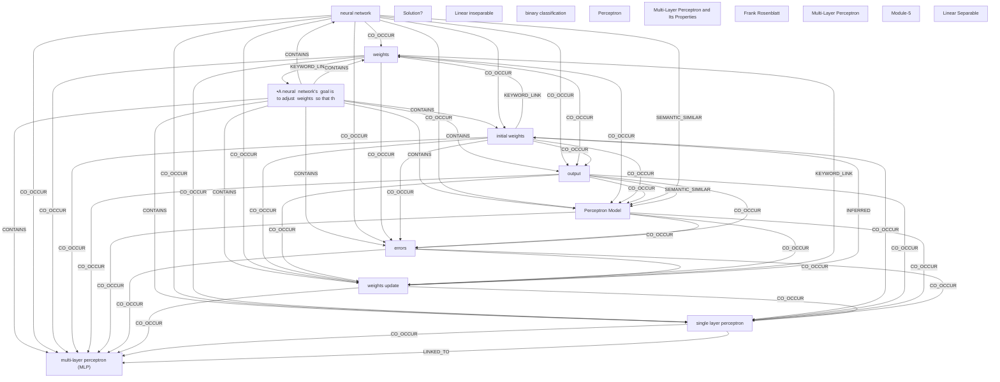

# Ontology: Neural Network

**Summary**: A computational model inspired by the human brain, designed for pattern recognition and learning.

## 🗺️ Visual Concept Map

## 🌳 Sequential Topic Tree
> Shows how topics are hierarchically and sequentially related

- [[•A neural  network's  goal is to adjust  weights  so that th]]
  - *( contains )*
  - [[multi-layer perceptron (MLP)]]
  - *( contains )*
  - [[neural network]]
    - *( co_occur )*
    - [[Perceptron Model]]
      - *( co_occur )*
      - [[single layer perceptron]]
      - *( co_occur )*
      - [[errors]]
        - *( co_occur )*
      - *( co_occur )*
      - [[weights update]]
        - *( keyword_link )*
        - *( inferred )*
    - *( co_occur )*
    - [[weights]]
      - *( co_occur )*
      - [[output]]
- [[Solution?]]
- [[Linear inseparable]]
- [[binary classification]]
- [[Perceptron]]
  - *( co_occur )*
  - [[Frank Rosenblatt]]
- [[initial weights]]
- [[Multi-Layer Perceptron and Its Properties]]
  - *( contains )*
  - [[Multi-Layer Perceptron]]
    - *( co_occur )*
    - [[Linear Separable]]
- [[Module-5]]

## 📋 All Core Concepts
- [[neural network]]
- [[multi-layer perceptron (MLP)]]
- [[single layer perceptron]]
- [[weights update]]
- [[Solution?]]
- [[Linear inseparable]]
- [[binary classification]]
- [[Perceptron Model]]
- [[Perceptron]]
- [[weights]]
- [[initial weights]]
- [[Multi-Layer Perceptron and Its Properties]]
- [[•A neural  network's  goal is to adjust  weights  so that th]]
- [[Frank Rosenblatt]]
- [[Multi-Layer Perceptron]]
- [[errors]]
- [[Module-5]]
- [[output]]
- [[Linear Separable]]
