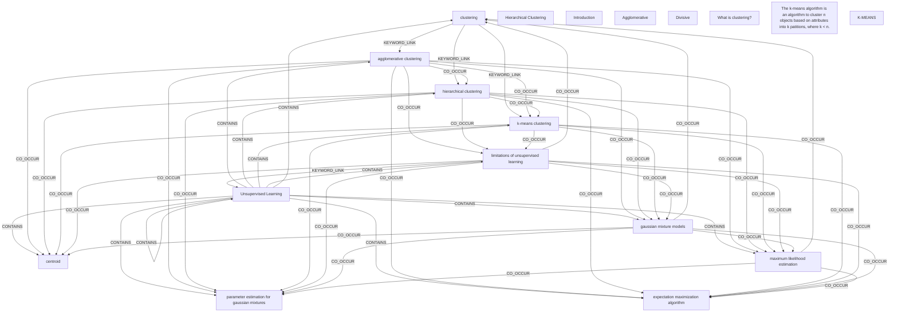

# Ontology: Neural Networks

**Summary**: A family of algorithms inspired by the human brain's neural connections.

## 🗺️ Visual Concept Map

## 🌳 Sequential Topic Tree
> Shows how topics are hierarchically and sequentially related

- [[Unsupervised Learning]]
  - *( contains )*
  - [[clustering]]
    - *( keyword_link )*
    - [[k-means clustering]]
      - *( co_occur )*
      - [[limitations of unsupervised learning]]
        - *( co_occur )*
        - *( co_occur )*
        - *( co_occur )*
      - *( co_occur )*
      - [[gaussian mixture models]]
        - *( co_occur )*
        - *( co_occur )*
        - *( co_occur )*
        - *( co_occur )*
      - *( co_occur )*
      - [[maximum likelihood estimation]]
        - *( co_occur )*
        - *( co_occur )*
        - *( co_occur )*
      - *( co_occur )*
      - [[parameter estimation for gaussian mixtures]]
        - *( co_occur )*
        - *( co_occur )*
      - *( co_occur )*
      - [[expectation maximization algorithm]]
        - *( co_occur )*
    - *( keyword_link )*
    - [[agglomerative clustering]]
      - *( co_occur )*
      - [[hierarchical clustering]]
    - *( co_occur )*
    - [[centroid]]
- [[Hierarchical Clustering]]
  - *( linked_to )*
  - [[Agglomerative]]
  - *( linked_to )*
  - [[Divisive]]
- [[Introduction]]
  - *( semantic_similar )*
  - [[What is clustering?]]
- [[The k-means algorithm is an algorithm to cluster n objects based on attributes into k patitions, where k < n.]]
  - *( keyword_link )*
  - [[K-MEANS]]

## 📋 All Core Concepts
- [[clustering]]
- [[gaussian mixture models]]
- [[parameter estimation for gaussian mixtures]]
- [[Hierarchical Clustering]]
- [[Introduction]]
- [[Agglomerative]]
- [[Divisive]]
- [[k-means clustering]]
- [[What is clustering?]]
- [[The k-means algorithm is an algorithm to cluster n objects based on attributes into k patitions, where k < n.]]
- [[K-MEANS]]
- [[centroid]]
- [[hierarchical clustering]]
- [[maximum likelihood estimation]]
- [[expectation maximization algorithm]]
- [[limitations of unsupervised learning]]
- [[agglomerative clustering]]
- [[Unsupervised Learning]]
