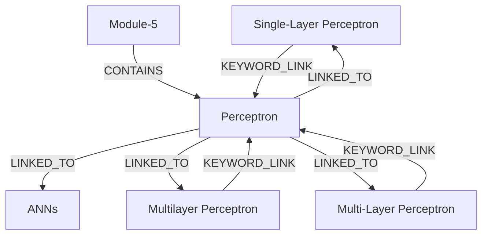

# Ontology: Neuron Structure

**Summary**: Explains the fundamental components of a neuron, including dendrites, cell body (soma), and axon.

## 🗺️ Visual Concept Map

## 🌳 Sequential Topic Tree
> Shows how topics are hierarchically and sequentially related

- [[Perceptron]]
  - *( linked_to )*
  - [[ANNs]]
  - *( linked_to )*
  - [[Multilayer Perceptron]]
  - *( linked_to )*
  - [[Single-Layer Perceptron]]
  - *( linked_to )*
  - [[Multi-Layer Perceptron]]
- [[Module-5]]

## 📋 All Core Concepts
- [[Single-Layer Perceptron]]
- [[Module-5]]
- [[Multi-Layer Perceptron]]
- [[Perceptron]]
- [[Multilayer Perceptron]]
- [[ANNs]]
