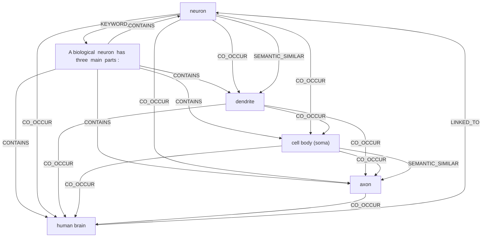

# Ontology: Neuron Structure

**Summary**: Explains the composition and function of a neuron.

## 🗺️ Visual Concept Map

## 🌳 Sequential Topic Tree
> Shows how topics are hierarchically and sequentially related

- [[A biological  neuron  has three  main  parts :]]
  - *( contains )*
  - [[human brain]]
    - *( linked_to )*
    - [[neuron]]
      - *( co_occur )*
      - [[dendrite]]
        - *( co_occur )*
        - *( co_occur )*
      - *( co_occur )*
      - [[cell body (soma)]]
        - *( co_occur )*
        - *( semantic_similar )*
      - *( co_occur )*
      - [[axon]]

## 📋 All Core Concepts
- [[neuron]]
- [[axon]]
- [[human brain]]
- [[A biological  neuron  has three  main  parts :]]
- [[cell body (soma)]]
- [[dendrite]]
