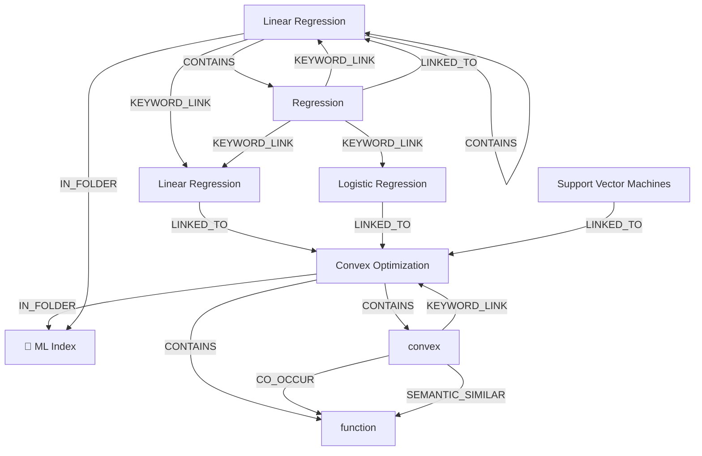

# Ontology: Optimization

**Summary**: The process of finding the best solution from all feasible solutions.

## 🗺️ Visual Concept Map

## 🌳 Sequential Topic Tree
> Shows how topics are hierarchically and sequentially related

- [[Convex Optimization]]
  - *( contains )*
  - [[function]]
  - *( in_folder )*
  - [[📁 ML Index]]
  - *( contains )*
  - [[convex]]
- [[Logistic Regression]]
- [[Support Vector Machines]]
- [[Linear Regression]]
  - *( keyword_link )*
  - [[Linear Regression]]
  - *( contains )*
  - [[Regression]]

## 📋 All Core Concepts
- [[function]]
- [[Logistic Regression]]
- [[📁 ML Index]]
- [[Support Vector Machines]]
- [[Linear Regression]]
- [[Regression]]
- [[convex]]
- [[Convex Optimization]]
- [[Linear Regression]]
