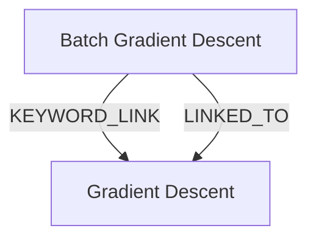

# Ontology: Optimization

**Summary**: The process of finding the best solution from all feasible solutions.

## 🗺️ Visual Concept Map

## 🌳 Sequential Topic Tree
> Shows how topics are hierarchically and sequentially related

- [[Gradient Descent]]
- [[Batch Gradient Descent]]

## 📋 All Core Concepts
- [[Batch Gradient Descent]]
- [[Gradient Descent]]
