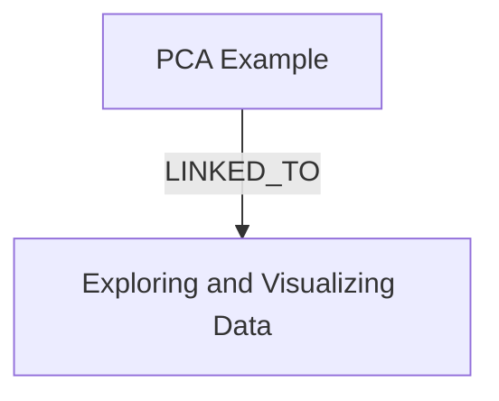

# Ontology: Optimization

**Summary**: The process of finding the best solution from all feasible solutions.

## 🗺️ Visual Concept Map

## 🌳 Sequential Topic Tree
> Shows how topics are hierarchically and sequentially related

- [[PCA Example]]
  - *( linked_to )*
  - [[Exploring and Visualizing Data]]

## 📋 All Core Concepts
- [[Exploring and Visualizing Data]]
- [[PCA Example]]
