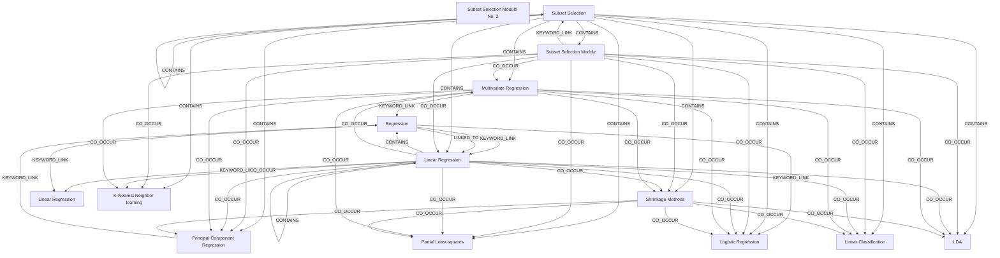

# Ontology: Optimization Techniques

**Summary**: Machine Learning Models, Gradient Descent, Batch Gradient Descent are optimization methods used in training models.

## 🗺️ Visual Concept Map

## 🌳 Sequential Topic Tree
> Shows how topics are hierarchically and sequentially related

- [[Subset Selection]]
  - *( contains )*
  - [[Linear Regression]]
    - *( co_occur )*
    - [[Logistic Regression]]
      - *( co_occur )*
      - [[LDA]]
        - *( co_occur )*
      - *( co_occur )*
      - [[K-Nearest Neighbor learning]]
    - *( co_occur )*
    - [[Multivariate Regression]]
      - *( co_occur )*
      - [[Principal Component Regression]]
        - *( co_occur )*
        - *( co_occur )*
      - *( co_occur )*
      - [[Shrinkage Methods]]
        - *( co_occur )*
        - *( co_occur )*
      - *( co_occur )*
      - [[Partial Least squares]]
        - *( co_occur )*
      - *( co_occur )*
      - [[Linear Classification]]
- [[Subset Selection Module No. 2]]
  - *( keyword_link )*
  - [[Subset Selection Module]]
- [[Regression]]
  - *( keyword_link )*
  - [[Linear Regression]]

## 📋 All Core Concepts
- [[Multivariate Regression]]
- [[Partial Least squares]]
- [[LDA]]
- [[Subset Selection Module No. 2]]
- [[Logistic Regression]]
- [[Subset Selection]]
- [[Subset Selection Module]]
- [[Shrinkage Methods]]
- [[Principal Component Regression]]
- [[Linear Regression]]
- [[Linear Classification]]
- [[Regression]]
- [[Linear Regression]]
- [[K-Nearest Neighbor learning]]
