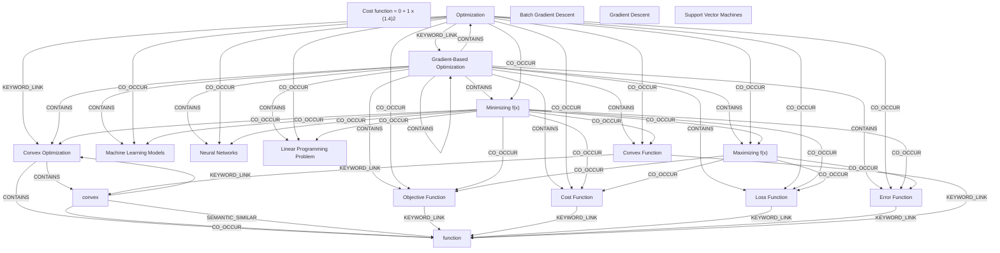

# Ontology: Optimization Techniques

**Summary**: Machine Learning Models, Gradient Descent, Batch Gradient Descent are optimization methods used in training models.

## 🗺️ Visual Concept Map

## 🌳 Sequential Topic Tree
> Shows how topics are hierarchically and sequentially related

- [[Cost Function]]
  - *( co_occur )*
  - [[Convex Optimization]]
    - *( co_occur )*
    - [[Convex Function]]
      - *( co_occur )*
      - [[Machine Learning Models]]
        - *( co_occur )*
      - *( co_occur )*
      - [[Neural Networks]]
      - *( keyword_link )*
      - [[function]]
      - *( keyword_link )*
      - [[convex]]
    - *( co_occur )*
    - [[Linear Programming Problem]]
  - *( co_occur )*
  - [[Loss Function]]
    - *( linked_to )*
    - [[Gradient-Based Optimization]]
    - *( co_occur )*
    - [[Error Function]]
- [[Cost function = 0 + 1 x (1.4)2]]
- [[Optimization]]
- [[Batch Gradient Descent]]
  - *( keyword_link )*
  - [[Gradient Descent]]
- [[Minimizing f(x)]]
- [[Objective Function]]
- [[Support Vector Machines]]
- [[Maximizing f(x)]]

## 📋 All Core Concepts
- [[Cost function = 0 + 1 x (1.4)2]]
- [[Optimization]]
- [[convex]]
- [[Cost Function]]
- [[Batch Gradient Descent]]
- [[Convex Function]]
- [[Machine Learning Models]]
- [[Error Function]]
- [[Minimizing f(x)]]
- [[Objective Function]]
- [[function]]
- [[Neural Networks]]
- [[Gradient-Based Optimization]]
- [[Gradient Descent]]
- [[Linear Programming Problem]]
- [[Loss Function]]
- [[Support Vector Machines]]
- [[Maximizing f(x)]]
- [[Convex Optimization]]
