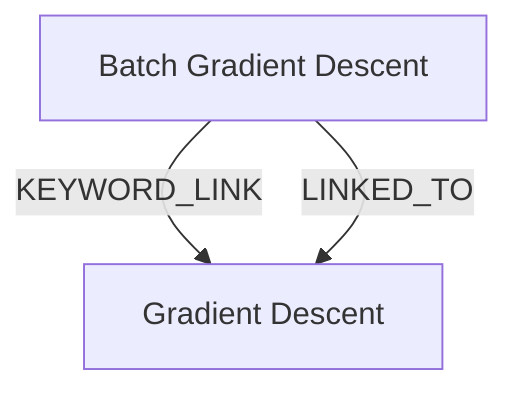

# Ontology: Optimization Techniques

**Summary**: Machine Learning Models, Gradient Descent, Batch Gradient Descent are optimization methods used in training models.

## 🗺️ Visual Concept Map

## 🌳 Sequential Topic Tree
> Shows how topics are hierarchically and sequentially related

- [[Gradient Descent]]
- [[Batch Gradient Descent]]

## 📋 All Core Concepts
- [[Batch Gradient Descent]]
- [[Gradient Descent]]
