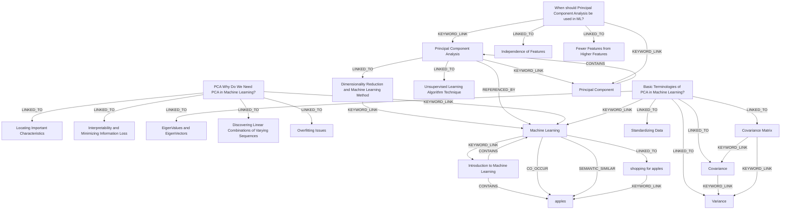

# Ontology: PCA Fundamentals

**Summary**: This set of concepts details the theory and application of Principal Component Analysis for dimensionality reduction in machine learning.

## 🗺️ Visual Concept Map

## 🌳 Sequential Topic Tree
> Shows how topics are hierarchically and sequentially related

- [[Machine Learning]]
  - *( keyword_link )*
  - [[Introduction to Machine Learning]]
    - *( contains )*
    - [[apples]]
  - *( linked_to )*
  - [[shopping for apples]]
- [[Dimensionality Reduction and Machine Learning Method]]
- [[Locating Important Characteristics]]
- [[Principal Component Analysis]]
  - *( keyword_link )*
  - [[Principal Component]]
  - *( linked_to )*
  - [[Unsupervised Learning Algorithm Technique]]
- [[Interpretability and Minimizing Information Loss]]
- [[PCA Why Do We Need PCA in Machine Learning?]]
  - *( linked_to )*
  - [[Overfitting Issues]]
  - *( linked_to )*
  - [[Discovering Linear Combinations of Varying Sequences]]
- [[EigenValues and EigenVectors]]
- [[When should Principal Component Analysis be used in ML?]]
  - *( linked_to )*
  - [[Independence of Features]]
  - *( linked_to )*
  - [[Fewer Features from Higher Features]]
- [[Covariance]]
  - *( keyword_link )*
  - [[Variance]]
- [[Basic Terminologies of PCA in Machine Learning?]]
  - *( linked_to )*
  - [[Covariance Matrix]]
  - *( linked_to )*
  - [[Standardizing Data]]

## 📋 All Core Concepts
- [[Dimensionality Reduction and Machine Learning Method]]
- [[Locating Important Characteristics]]
- [[Principal Component Analysis]]
- [[shopping for apples]]
- [[Interpretability and Minimizing Information Loss]]
- [[PCA Why Do We Need PCA in Machine Learning?]]
- [[EigenValues and EigenVectors]]
- [[Discovering Linear Combinations of Varying Sequences]]
- [[When should Principal Component Analysis be used in ML?]]
- [[Unsupervised Learning Algorithm Technique]]
- [[Covariance]]
- [[Overfitting Issues]]
- [[Basic Terminologies of PCA in Machine Learning?]]
- [[Introduction to Machine Learning]]
- [[apples]]
- [[Machine Learning]]
- [[Variance]]
- [[Standardizing Data]]
- [[Independence of Features]]
- [[Covariance Matrix]]
- [[Principal Component]]
- [[Fewer Features from Higher Features]]
