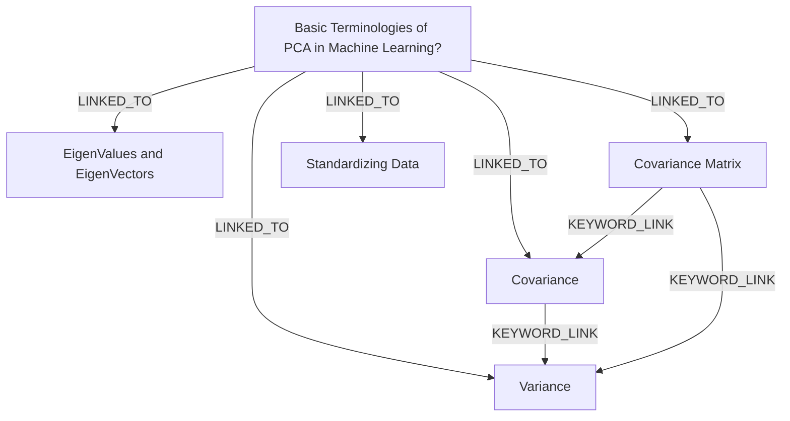

# Ontology: PCA Fundamentals

**Summary**: These concepts form the mathematical foundation for dimensionality reduction techniques in machine learning.

## 🗺️ Visual Concept Map

## 🌳 Sequential Topic Tree
> Shows how topics are hierarchically and sequentially related

- [[Basic Terminologies of PCA in Machine Learning?]]
  - *( linked_to )*
  - [[Variance]]
  - *( linked_to )*
  - [[Covariance]]
  - *( linked_to )*
  - [[Covariance Matrix]]
  - *( linked_to )*
  - [[Standardizing Data]]
  - *( linked_to )*
  - [[EigenValues and EigenVectors]]

## 📋 All Core Concepts
- [[Covariance]]
- [[Basic Terminologies of PCA in Machine Learning?]]
- [[EigenValues and EigenVectors]]
- [[Variance]]
- [[Covariance Matrix]]
- [[Standardizing Data]]
