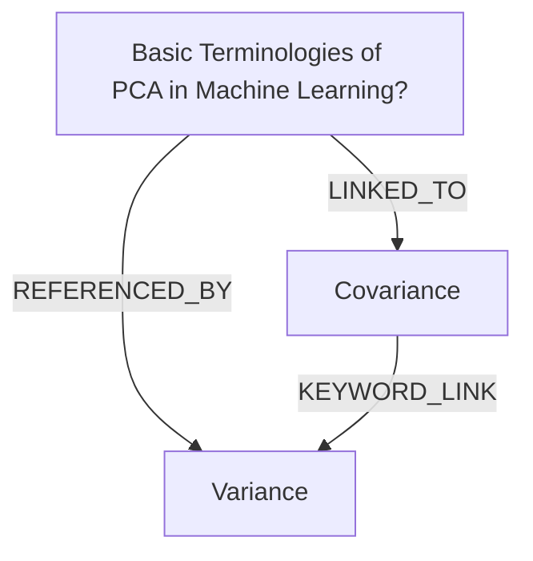

# Ontology: PCA Terminology

**Summary**: Principal Component Analysis key concepts in machine learning.

## 🗺️ Visual Concept Map

## 🌳 Sequential Topic Tree
> Shows how topics are hierarchically and sequentially related

- [[Basic Terminologies of PCA in Machine Learning?]]
  - *( referenced_by )*
  - [[Variance]]
  - *( linked_to )*
  - [[Covariance]]

## 📋 All Core Concepts
- [[Variance]]
- [[Covariance]]
- [[Basic Terminologies of PCA in Machine Learning?]]
