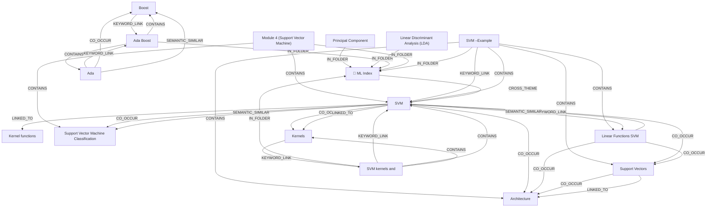

# Ontology: PCA Terminology

**Summary**: Principal Component Analysis key concepts explained.

## 🗺️ Visual Concept Map

## 🌳 Sequential Topic Tree
> Shows how topics are hierarchically and sequentially related

- [[📁 ML Index]]
  - *( cross_theme )*
  - [[SVM]]
    - *( semantic_similar )*
    - [[Linear Functions SVM]]
      - *( co_occur )*
      - [[Support Vectors]]
        - *( co_occur )*
        - *( linked_to )*
      - *( co_occur )*
      - [[Architecture]]
    - *( co_occur )*
    - [[Support Vector Machine Classification]]
- [[Principal Component]]
- [[Boost]]
  - *( keyword_link )*
  - [[Ada Boost]]
    - *( contains )*
    - [[Ada]]
- [[Kernel functions]]
- [[SVM –Example]]
- [[Kernels]]
  - *( keyword_link )*
  - [[SVM kernels and]]
- [[Module 4 (Support Vector Machine)]]
- [[Linear Discriminant Analysis (LDA)]]

## 📋 All Core Concepts
- [[Principal Component]]
- [[Boost]]
- [[Kernel functions]]
- [[SVM –Example]]
- [[Support Vector Machine Classification]]
- [[📁 ML Index]]
- [[Kernels]]
- [[Module 4 (Support Vector Machine)]]
- [[SVM]]
- [[Architecture]]
- [[Support Vectors]]
- [[Ada Boost]]
- [[SVM kernels and]]
- [[Linear Discriminant Analysis (LDA)]]
- [[Ada]]
- [[Linear Functions SVM]]
