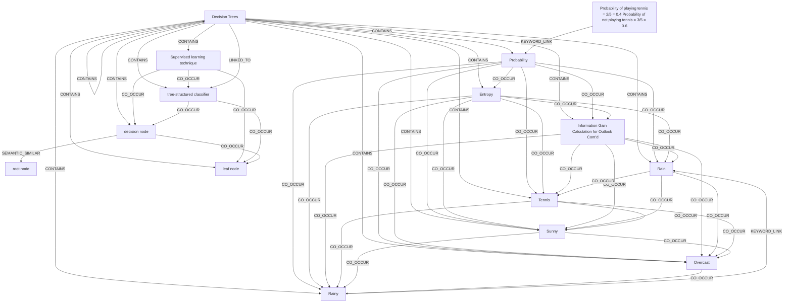

# Ontology: Regression Analysis

**Summary**: Exploring Ridge Regression's parameters and cost function.

## 🗺️ Visual Concept Map

## 🌳 Sequential Topic Tree
> Shows how topics are hierarchically and sequentially related

- [[Decision Trees]]
  - *( contains )*
  - [[Probability]]
    - *( co_occur )*
    - [[Tennis]]
      - *( co_occur )*
      - [[Sunny]]
        - *( co_occur )*
        - *( co_occur )*
      - *( co_occur )*
      - [[Overcast]]
        - *( co_occur )*
      - *( co_occur )*
      - [[Rainy]]
        - *( keyword_link )*
    - *( co_occur )*
    - [[Entropy]]
      - *( co_occur )*
      - [[Information Gain Calculation for Outlook Cont’d]]
        - *( co_occur )*
      - *( co_occur )*
      - [[Rain]]
- [[root node]]
- [[tree-structured classifier]]
  - *( co_occur )*
  - [[decision node]]
    - *( co_occur )*
    - [[leaf node]]
- [[Probability of playing tennis = 2/5 = 0.4 Probability of not playing tennis = 3/5 = 0.6]]
- [[Supervised learning technique]]

## 📋 All Core Concepts
- [[root node]]
- [[tree-structured classifier]]
- [[Probability]]
- [[Information Gain Calculation for Outlook Cont’d]]
- [[Rain]]
- [[decision node]]
- [[Overcast]]
- [[Probability of playing tennis = 2/5 = 0.4 Probability of not playing tennis = 3/5 = 0.6]]
- [[Entropy]]
- [[Sunny]]
- [[Supervised learning technique]]
- [[Decision Trees]]
- [[leaf node]]
- [[Tennis]]
- [[Rainy]]
