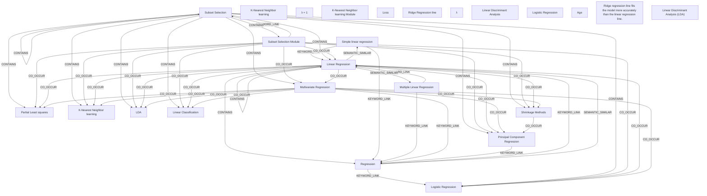

# Ontology: Regression Analysis

**Summary**: A statistical method for modeling the relationship between a dependent variable and one or more independent variables.

## 🗺️ Visual Concept Map

## 🌳 Sequential Topic Tree
> Shows how topics are hierarchically and sequentially related

- [[Logistic Regression]]
  - *( co_occur )*
  - [[LDA]]
    - *( co_occur )*
    - [[K-Nearest Neighbor learning]]
  - *( cross_theme )*
  - [[Loss]]
    - *( co_occur )*
    - [[Ridge Regression line]]
      - *( keyword_link )*
      - [[Regression]]
        - *( keyword_link )*
        - *( semantic_similar )*
        - *( linked_to )*
  - *( cross_theme )*
  - [[Ridge regression line fits the model more accurately than the linear regression line.]]
    - *( keyword_link )*
    - [[Linear Regression]]
      - *( co_occur )*
      - [[Principal Component Regression]]
        - *( co_occur )*
- [[Partial Least squares]]
  - *( co_occur )*
  - [[Linear Classification]]
- [[Simple linear regression]]
- [[Subset Selection]]
- [[Multivariate Regression]]
- [[K-Nearest Neighbor learning]]
- [[λ = 1]]
  - *( keyword_link )*
  - [[λ]]
- [[K-Nearest Neighbor learning Module]]
- [[Linear Discriminant Analysis]]
  - *( keyword_link )*
  - [[Linear Discriminant Analysis (LDA)]]
  - *( semantic_similar )*
  - [[discriminant function analysis (DFA)]]
  - *( semantic_similar )*
  - [[normal discriminant analysis (NDA)]]
- [[Logistic Regression]]
  - *( referenced_by )*
  - [[Age]]
    - *( keyword_link )*
    - [[Shrinkage Methods]]
  - *( contains )*
  - [[Coronary Heart Disease (CD)]]
- [[Subset Selection Module]]
- [[Multiple Linear Regression]]

## 📋 All Core Concepts
- [[Partial Least squares]]
- [[Simple linear regression]]
- [[Subset Selection]]
- [[Multivariate Regression]]
- [[K-Nearest Neighbor learning]]
- [[K-Nearest Neighbor learning]]
- [[λ = 1]]
- [[K-Nearest Neighbor learning Module]]
- [[Loss]]
- [[Ridge Regression line]]
- [[Linear Regression]]
- [[Regression]]
- [[LDA]]
- [[λ]]
- [[Principal Component Regression]]
- [[Linear Discriminant Analysis]]
- [[Logistic Regression]]
- [[Age]]
- [[Ridge regression line fits the model more accurately than the linear regression line.]]
- [[Linear Discriminant Analysis (LDA)]]
- [[Linear Classification]]
- [[Logistic Regression]]
- [[Subset Selection Module]]
- [[Multiple Linear Regression]]
- [[Shrinkage Methods]]
