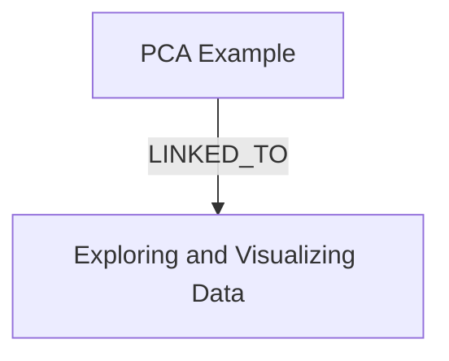

# Ontology: Regression Analysis

**Summary**: Exploring Ridge Regression's parameters and cost function.

## 🗺️ Visual Concept Map

## 🌳 Sequential Topic Tree
> Shows how topics are hierarchically and sequentially related

- [[PCA Example]]
  - *( linked_to )*
  - [[Exploring and Visualizing Data]]

## 📋 All Core Concepts
- [[Exploring and Visualizing Data]]
- [[PCA Example]]
