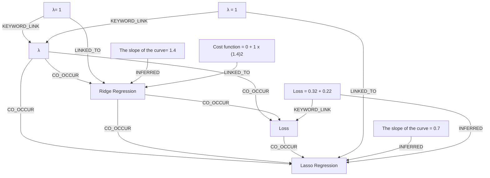

# Ontology: Regression Analysis

**Summary**: Exploring Ridge Regression's parameters and cost function.

## 🗺️ Visual Concept Map

## 🌳 Sequential Topic Tree
> Shows how topics are hierarchically and sequentially related

- [[Ridge Regression]]
  - *( co_occur )*
  - [[Lasso Regression]]
  - *( co_occur )*
  - [[Loss]]
- [[λ= 1]]
  - *( keyword_link )*
  - [[λ]]
- [[Cost function = 0 + 1 x (1.4)2]]
- [[Loss = 0.32 + 0.22]]
- [[λ = 1]]
- [[The slope of the curve = 0.7]]
- [[The slope of the curve= 1.4]]

## 📋 All Core Concepts
- [[λ= 1]]
- [[Cost function = 0 + 1 x (1.4)2]]
- [[Loss = 0.32 + 0.22]]
- [[λ]]
- [[λ = 1]]
- [[Loss]]
- [[Ridge Regression]]
- [[The slope of the curve = 0.7]]
- [[The slope of the curve= 1.4]]
- [[Lasso Regression]]
