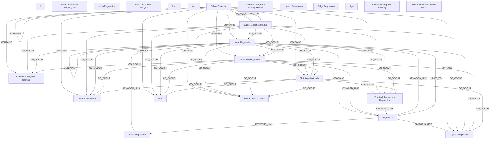

# Ontology: Regression Modeling Techniques

**Summary**: This collection focuses on various statistical methods for modeling relationships and making predictions.

## 🗺️ Visual Concept Map

## 🌳 Sequential Topic Tree
> Shows how topics are hierarchically and sequentially related

- [[Subset Selection]]
  - *( contains )*
  - [[Linear Regression]]
    - *( co_occur )*
    - [[Logistic Regression]]
      - *( co_occur )*
      - [[LDA]]
        - *( co_occur )*
      - *( co_occur )*
      - [[K-Nearest Neighbor learning]]
    - *( co_occur )*
    - [[Principal Component Regression]]
      - *( co_occur )*
      - [[Partial Least squares]]
        - *( co_occur )*
      - *( co_occur )*
      - [[Linear Classification]]
    - *( co_occur )*
    - [[Multivariate Regression]]
      - *( co_occur )*
      - [[Shrinkage Methods]]
- [[λ]]
  - *( co_occur )*
  - [[Ridge Regression]]
    - *( keyword_link )*
    - [[Regression]]
      - *( keyword_link )*
      - [[Linear Regression]]
    - *( co_occur )*
    - [[Lasso Regression]]
- [[Linear Discriminant Analysis (LDA)]]
  - *( contains )*
  - [[Linear Discriminant Analysis]]
    - *( referenced_by )*
    - [[PCA Vs LDA]]
- [[λ = 1]]
- [[λ= 1]]
- [[K-Nearest Neighbor learning Module]]
- [[Subset Selection Module]]
- [[Logistic Regression]]
  - *( contains )*
  - [[Age]]
- [[K-Nearest Neighbor learning]]
- [[Subset Selection Module No. 2]]

## 📋 All Core Concepts
- [[λ]]
- [[Linear Discriminant Analysis (LDA)]]
- [[Lasso Regression]]
- [[Linear Discriminant Analysis]]
- [[Linear Regression]]
- [[Linear Classification]]
- [[λ = 1]]
- [[λ= 1]]
- [[Subset Selection]]
- [[K-Nearest Neighbor learning Module]]
- [[Subset Selection Module]]
- [[Logistic Regression]]
- [[Principal Component Regression]]
- [[K-Nearest Neighbor learning]]
- [[Logistic Regression]]
- [[Ridge Regression]]
- [[Linear Regression]]
- [[LDA]]
- [[Shrinkage Methods]]
- [[Age]]
- [[Regression]]
- [[Partial Least squares]]
- [[K-Nearest Neighbor learning]]
- [[Multivariate Regression]]
- [[Subset Selection Module No. 2]]
