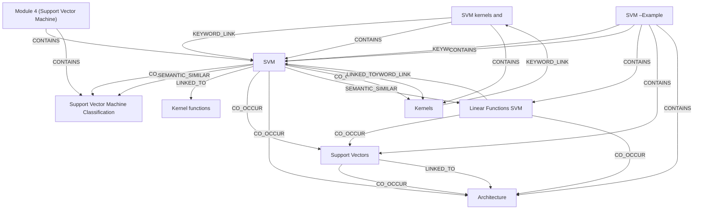

# Ontology: SVM Fundamentals

**Summary**: This group focuses on the core concepts, mathematical foundations, and practical application of Support Vector Machines.

## 🗺️ Visual Concept Map

## 🌳 Sequential Topic Tree
> Shows how topics are hierarchically and sequentially related

- [[SVM]]
  - *( semantic_similar )*
  - [[Linear Functions SVM]]
    - *( co_occur )*
    - [[Support Vectors]]
      - *( co_occur )*
      - [[Architecture]]
  - *( co_occur )*
  - [[Support Vector Machine Classification]]
- [[SVM kernels and]]
  - *( contains )*
  - [[Kernels]]
- [[Module 4 (Support Vector Machine)]]
- [[SVM –Example]]
- [[Kernel functions]]

## 📋 All Core Concepts
- [[Support Vector Machine Classification]]
- [[SVM kernels and]]
- [[Module 4 (Support Vector Machine)]]
- [[SVM –Example]]
- [[Support Vectors]]
- [[SVM]]
- [[Kernels]]
- [[Architecture]]
- [[Kernel functions]]
- [[Linear Functions SVM]]
