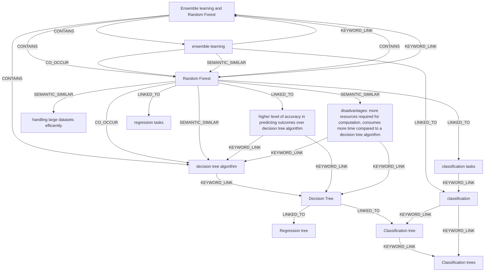

# Ontology: Tree-based Models

**Summary**: Classification and regression models using decision trees, with ensemble methods for improved accuracy and efficiency.

## 🗺️ Visual Concept Map

## 🌳 Sequential Topic Tree
> Shows how topics are hierarchically and sequentially related

- [[Decision Tree]]
  - *( linked_to )*
  - [[Classification tree]]
    - *( keyword_link )*
    - [[Classification trees]]
  - *( linked_to )*
  - [[Regression tree]]
- [[Ensemble learning and Random Forest]]
  - *( contains )*
  - [[Random Forest]]
    - *( co_occur )*
    - [[decision tree algorithm]]
    - *( semantic_similar )*
    - [[disadvantages: more resources required for computation, consumes more time compared to a decision tree algorithm]]
    - *( linked_to )*
    - [[higher level of accuracy in predicting outcomes over decision tree algorithm]]
  - *( contains )*
  - [[ensemble learning]]
    - *( linked_to )*
    - [[classification]]
- [[handling large datasets efficiently]]
- [[regression tasks]]
- [[classification tasks]]

## 📋 All Core Concepts
- [[Ensemble learning and Random Forest]]
- [[decision tree algorithm]]
- [[disadvantages: more resources required for computation, consumes more time compared to a decision tree algorithm]]
- [[Regression tree]]
- [[Classification tree]]
- [[Classification trees]]
- [[handling large datasets efficiently]]
- [[Decision Tree]]
- [[Random Forest]]
- [[higher level of accuracy in predicting outcomes over decision tree algorithm]]
- [[regression tasks]]
- [[classification tasks]]
- [[classification]]
- [[ensemble learning]]
