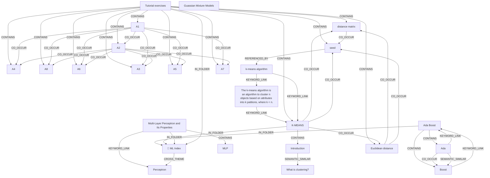

# Ontology: Unsupervised Learning Methods

**Summary**: This collection covers foundational algorithms for grouping and analyzing data structures without labeled examples.

## 🗺️ Visual Concept Map

## 🌳 Sequential Topic Tree
> Shows how topics are hierarchically and sequentially related

- [[📁 ML Index]]
  - *( cross_theme )*
  - [[Perceptron]]
    - *( linked_to )*
    - [[Multi-Layer Perceptron]]
    - *( linked_to )*
    - [[ANNs]]
    - *( linked_to )*
    - [[Multilayer Perceptron]]
    - *( linked_to )*
    - [[Single-Layer Perceptron]]
- [[distance matrix]]
  - *( co_occur )*
  - [[seed]]
    - *( referenced_by )*
    - [[k-means algorithm]]
      - *( keyword_link )*
      - [[K-MEANS]]
        - *( co_occur )*
        - *( contains )*
      - *( keyword_link )*
      - [[The k-means algorithm is an algorithm to cluster n objects based on attributes into k patitions, where k < n.]]
- [[A4]]
  - *( co_occur )*
  - [[A5]]
    - *( co_occur )*
    - [[A6]]
      - *( co_occur )*
      - [[A7]]
        - *( co_occur )*
      - *( co_occur )*
      - [[A8]]
- [[Multi-Layer Perceptron and Its Properties]]
  - *( contains )*
  - [[MLP]]
    - *( co_occur )*
    - [[LTU]]
- [[Introduction]]
  - *( semantic_similar )*
  - [[What is clustering?]]
- [[Ada Boost]]
  - *( contains )*
  - [[Ada]]
    - *( co_occur )*
    - [[Boost]]
- [[A1]]
  - *( co_occur )*
  - [[A2]]
    - *( co_occur )*
    - [[A3]]
- [[Tutorial exercises]]
- [[Guassian Mixture Models]]
- [[Euclidean distance]]

## 📋 All Core Concepts
- [[distance matrix]]
- [[📁 ML Index]]
- [[A4]]
- [[Multi-Layer Perceptron and Its Properties]]
- [[seed]]
- [[Introduction]]
- [[K-MEANS]]
- [[Ada Boost]]
- [[MLP]]
- [[A1]]
- [[A8]]
- [[A6]]
- [[A3]]
- [[The k-means algorithm is an algorithm to cluster n objects based on attributes into k patitions, where k < n.]]
- [[A5]]
- [[k-means algorithm]]
- [[Perceptron]]
- [[Boost]]
- [[What is clustering?]]
- [[Tutorial exercises]]
- [[Guassian Mixture Models]]
- [[Ada]]
- [[A2]]
- [[A7]]
- [[Euclidean distance]]
