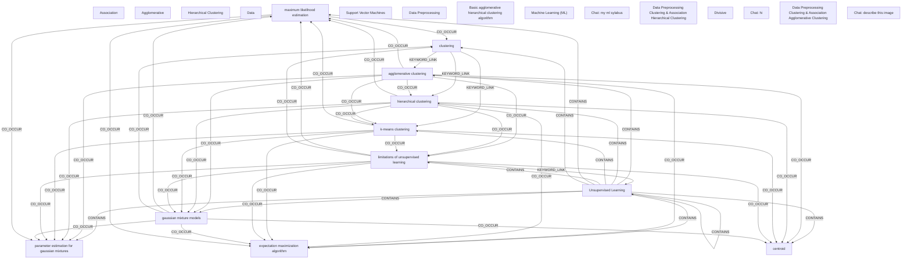

# Ontology: Unsupervised Pattern Discovery

**Summary**: This collection focuses on techniques for finding hidden structures and relationships within unlabeled datasets.

## 🗺️ Visual Concept Map

## 🌳 Sequential Topic Tree
> Shows how topics are hierarchically and sequentially related

- [[clustering]]
  - *( keyword_link )*
  - [[hierarchical clustering]]
    - *( co_occur )*
    - [[gaussian mixture models]]
      - *( co_occur )*
      - [[maximum likelihood estimation]]
        - *( co_occur )*
        - *( co_occur )*
        - *( co_occur )*
      - *( co_occur )*
      - [[parameter estimation for gaussian mixtures]]
        - *( co_occur )*
        - *( co_occur )*
      - *( co_occur )*
      - [[expectation maximization algorithm]]
        - *( co_occur )*
      - *( co_occur )*
      - [[centroid]]
    - *( co_occur )*
    - [[k-means clustering]]
      - *( co_occur )*
      - [[limitations of unsupervised learning]]
        - *( keyword_link )*
  - *( keyword_link )*
  - [[agglomerative clustering]]
  - *( co_occur )*
  - [[Association]]
- [[Agglomerative]]
- [[Hierarchical Clustering]]
  - *( linked_to )*
  - [[Divisive]]
- [[Data]]
  - *( contains )*
  - [[Data Preprocessing]]
  - *( keyword_link )*
  - [[Exploring and Visualizing Data]]
- [[Support Vector Machines]]
- [[Basic agglomerative hierarchical clustering algorithm]]
- [[Machine Learning (ML)]]
  - *( discussed/decided/assigned/linked_to )*
  - [[Unsupervised Learning]]
  - *( discussed/decided/assigned/linked_to )*
  - [[Supervised Learning]]
  - *( discussed/decided/assigned/linked_to )*
  - [[Reinforcement Learning]]
- [[Chat: my ml sylabus]]
  - *( discusses )*
  - [[Dimensionality Reduction]]
- [[Data Preprocessing Clustering & Association Hierarchical Clustering]]
- [[Chat: hi]]
- [[Data Preprocessing Clustering & Association Agglomerative Clustering]]
- [[Chat: describe this image]]
- [[Unsupervised Learning]]

## 📋 All Core Concepts
- [[Association]]
- [[Agglomerative]]
- [[Hierarchical Clustering]]
- [[Data]]
- [[maximum likelihood estimation]]
- [[Support Vector Machines]]
- [[Data Preprocessing]]
- [[limitations of unsupervised learning]]
- [[expectation maximization algorithm]]
- [[Basic agglomerative hierarchical clustering algorithm]]
- [[Machine Learning (ML)]]
- [[Chat: my ml sylabus]]
- [[Data Preprocessing Clustering & Association Hierarchical Clustering]]
- [[Divisive]]
- [[hierarchical clustering]]
- [[centroid]]
- [[Chat: hi]]
- [[Data Preprocessing Clustering & Association Agglomerative Clustering]]
- [[Chat: describe this image]]
- [[clustering]]
- [[parameter estimation for gaussian mixtures]]
- [[k-means clustering]]
- [[gaussian mixture models]]
- [[Unsupervised Learning]]
- [[agglomerative clustering]]
